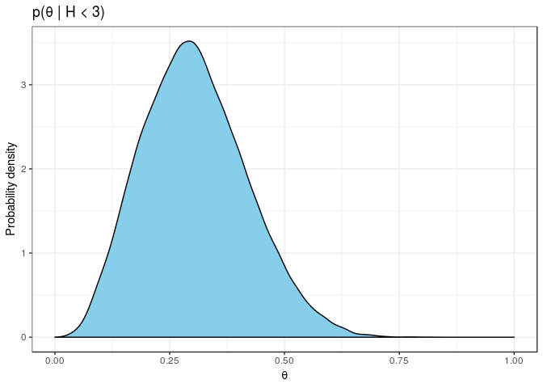

Here's my solution to exercise 1, chapter 2, of
[Gelman's](https://andrewgelman.com/) *Bayesian Data Analysis* (BDA),
3rd edition. There are
[solutions](http://www.stat.columbia.edu/~gelman/book/solutions.pdf) to
some of the exercises on the [book's
webpage](http://www.stat.columbia.edu/~gelman/book/).

<!--more-->
<div style="display:none">

$\DeclareMathOperator{\dbinomial}{binomial}  \DeclareMathOperator{\dbern}{Bernoulli}  \DeclareMathOperator{\dbeta}{beta}$

</div>

Let $H$ be the number of heads in 10 tosses of the coin. With a
$\dbeta(4, 4)$ prior on the probability $\theta$ of a head, the
posterior after finding out $H \le 2$ is

$$
\begin{align}
  p(\theta \mid H \le 2)
  &\propto
  p(H \le 2 \mid \theta) \cdot p(\theta)
  \\
  &=
  \dbeta(\theta \mid 4, 4) \sum_{h = 0}^2 \dbinomial(h \mid \theta, 10)
  \\
  &=
  \theta^3 (1 - \theta)^3 \sum_{h = 0}^2 \binom{10}{h} \theta^h (1 - \theta)^{10 - h}.
\end{align}
$$

We can plot this unnormalised posterior density from the following
dataset.

``` {.r}
ex1 <- tibble(
         theta = seq(0, 1, 0.01), 
         prior = theta^3 * (1 - theta)^3,
         posterior = prior * (
           choose(10, 0) * theta^0 * (1 - theta)^10 +
           choose(10, 1) * theta^1 * (1 - theta)^9 +
           choose(10, 2) * theta^2 * (1 - theta)^8 
         )
       )
```


With the help of [Stan](http://mc-stan.org/), we can obtain the
normalised posterior density. We include the information that there are
at most 2 heads observed by using the (log) cumulative density function.

``` {.r}
m1 <- rstan::stan_model('src/ex_02_01.stan')
```

    S4 class stanmodel 'ex_02_01' coded as follows:
    transformed data {
      int tosses = 10;
      int max_heads = 2;
    }

    parameters {
      real<lower = 0, upper = 1> theta;
    }

    model {
      theta ~ beta(4, 4); // prior 
      target += binomial_lcdf(max_heads | tosses, theta); // likelihood
    } 

The following posterior has the same shape as our exact unnormalised
density above. The difference is that we now have a normalised
probability distribution without having to work out the maths ourselves.

``` {.r}
f1 <- sampling(m1, iter = 40000, warmup = 500, chains = 1)
```


