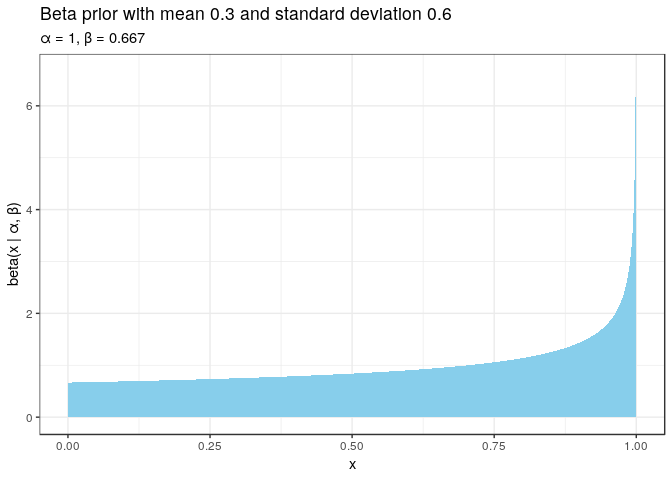

Here's my solution to exercise 9, chapter 2, of
[Gelman's](https://andrewgelman.com/) *Bayesian Data Analysis* (BDA),
3rd edition. There are
[solutions](http://www.stat.columbia.edu/~gelman/book/solutions.pdf) to
some of the exercises on the [book's
webpage](http://www.stat.columbia.edu/~gelman/book/).

<!--more-->
<div style="display:none">

$\DeclareMathOperator{\dbinomial}{binomial}  \DeclareMathOperator{\dbern}{Bernoulli}  \DeclareMathOperator{\dnorm}{normal}  \DeclareMathOperator{\dgamma}{gamma}  \DeclareMathOperator{\invlogit}{invlogit}  \DeclareMathOperator{\logit}{logit}  \DeclareMathOperator{\dbeta}{beta}$

</div>

The data show 650 people in support of the death penalty and 350
against. We explore the effect of different priors on the posterior.

First let's find the prior with a mean of 0.6 and standard deviation
0.3. The mean of the $\dbeta(\alpha, \beta)$ distribution is

$$
\frac{3}{5}
=
\frac{\alpha}{\alpha + \beta}
$$

which implies that $\alpha = 1.5 \beta$. The variance is

$$
\begin{align}
  \frac{9}{100}
  &=
  \frac{\alpha \beta}{(\alpha + \beta)^2 (\alpha + \beta  + 1)}
  \\
  &=
  \frac{3}{2} \frac{\beta^2}{\frac{25}{4}\beta^2 \frac{5\beta + 2}{2}}
  \\
  &=
  \frac{3}{2}\frac{4}{25}\frac{2}{5\beta + 2}
  \\
  &=
  \frac{12}{25(5\beta + 2)}
  \\
  &\Leftrightarrow
  \\
  5\beta + 2
  &=
  \frac{12}{25}\frac{100}{9}
  \\
  &=
  4,
\end{align}
$$

which implies that $\beta = \frac{2}{5}$. Thus $\alpha = \frac{3}{5}$.
Since both parameters are below 1, we see maxima near 0 and 1.

``` {.r}
α <- 3 / 5
β <- 2 / 5

tibble(x = seq(0, 1, 0.001), y = dbeta(x, α, β)) %>% 
  ggplot() +
  aes(x, y) +
  geom_area(fill = 'skyblue') +
  labs(
    x = 'x',
    y = 'beta(x | α, β)',
    title = 'Beta prior with mean 0.3 and standard deviation 0.6',
    subtitle = str_glue('α = {α}, β = {β}')
  )
```



The beta distribution is self-conjugate so the posterior is
$\dbeta(0.6 + 650, 0.4 + 350)$.

Let's plot the posterior with priors of different strength. We can
increase the strength of the prior whilst keeping the mean constant by
multiplying $\alpha$ and $\beta$ by the same constant c. We will use
$c \in \{ 1, 10, 100, 1000\}$. In the plot below, we have restricted the
x-axis to focus on the differences in the shape of the posteriors.

``` {.r}
support <- 650
against <- 350

expand.grid(magnitude = 0:3, x = seq(0, 1, 0.001)) %>% 
  as_tibble() %>% 
  mutate(
    c = 10^magnitude,
    a_prior = α * c,
    b_prior = β * c,
    y = dbeta(x, support + a_prior, against + b_prior),
    prior_magnitude = factor(as.character(10^magnitude))
  ) %>%
  ggplot() +
  aes(x, y, colour = prior_magnitude) +
  geom_line() +
  scale_x_continuous(limits = c(0.55, 0.75)) +
  labs(
    x = 'x',
    y = 'beta(x | support + a, against + b)',
    title = 'Beta posterior with different priors',
    subtitle = str_glue(paste(
      'a = {α} * 10^magnitude, b = {β} * 10^magnitude',
      'support = 650, against = 350',
      sep = '\n'
    )),
    colour = 'Magnitude of the prior'
  )
```


Magnitudes 1 and 10 give very similar results close to the maximum
likelihood estimate of 65%. The higher magnitudes pull the mean towards
the prior mean of 60%.
