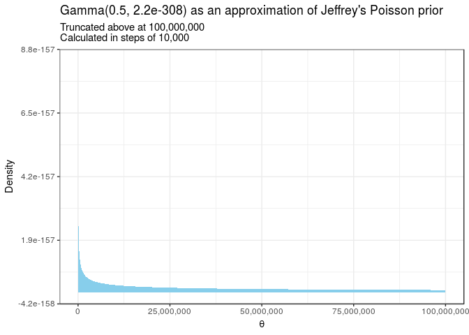

Here's my solution to exercise 12, chapter 2, of
[Gelman's](https://andrewgelman.com/) *Bayesian Data Analysis* (BDA),
3rd edition. There are
[solutions](http://www.stat.columbia.edu/~gelman/book/solutions.pdf) to
some of the exercises on the [book's
webpage](http://www.stat.columbia.edu/~gelman/book/).

<!--more-->
<div style="display:none">

$\DeclareMathOperator{\dbinomial}{binomial}  \DeclareMathOperator{\dbern}{Bernoulli}  \DeclareMathOperator{\dnorm}{normal}  \DeclareMathOperator{\dcauchy}{Cauchy}  \DeclareMathOperator{\dgamma}{gamma}  \DeclareMathOperator{\invlogit}{invlogit}  \DeclareMathOperator{\logit}{logit}  \DeclareMathOperator{\dbeta}{beta}$

</div>

Suppose $\theta$ has a Poisson likelihood so that
$\log p(y \mid \theta) \propto y \log(\theta) - \theta$. We will find
Jeffrey's prior for $\theta$ and the gamma distribution that most
closely approximates it.

The derivative of the log likelihood is $\frac{y}{\theta} - 1$ and the
second derivative is $-\frac{y}{\theta^2}$. It follows that the Fisher
information for $\theta$ is

$$
J(\theta)
=
\mathbb E \left( \frac{y}{\theta^2} \right)
=
\frac{1}{\theta}
,
$$

so Jeffrey's prior is $p(\theta) \propto \frac{1}{\sqrt{\theta}}$. This
is an improper prior because

$$
\int_0^\infty \theta^{-\frac{1}{2}} d\theta
=
\left[ 2\theta^{\frac{1}{2}} \right]_0^\infty
=
\infty
.
$$

Since Jeffrey's prior is improper, we can try approximate it with a
gamma prior. Let $\alpha, \beta \in (0, \infty)$ be the shape and rate
parameters of a gamma distribution. Then

$$
\dgamma(\theta \mid \alpha, \beta) 
\propto
x^{\alpha - 1}e^{-\beta x}
.
$$

Choosing $\alpha = \frac{1}{2}$ and $\beta = 0$ yields Jeffrey's prior.
However, $\beta$ must be positive for the gamma distribution to be
proper, so we can choose $\beta = \epsilon$ sufficiently small. We'll
use the [smallest positive
float](https://stat.ethz.ch/R-manual/R-devel/library/base/html/zMachine.html)
representable in R.

``` {.r}
epsilon <- .Machine$double.xmin

upper_limit <- 100000000
step <- upper_limit / 10000

prior <- tibble(theta = seq(0, upper_limit, step)) %>% 
  mutate(density = dgamma(theta, 0.5, epsilon)) 
```


