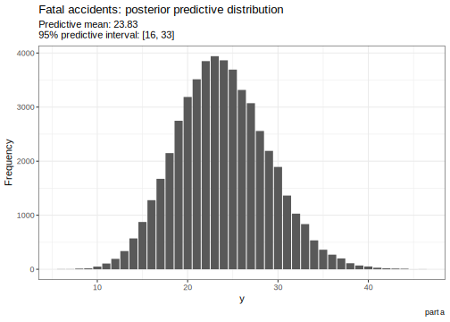

Here's my solution to exercise 13, chapter 2, of
[Gelman's](https://andrewgelman.com/) *Bayesian Data Analysis* (BDA),
3rd edition. There are
[solutions](http://www.stat.columbia.edu/~gelman/book/solutions.pdf) to
some of the exercises on the [book's
webpage](http://www.stat.columbia.edu/~gelman/book/).

<!--more-->
<div style="display:none">

$\DeclareMathOperator{\dbinomial}{binomial}  \DeclareMathOperator{\dbern}{Bernoulli}  \DeclareMathOperator{\dpois}{Poisson}  \DeclareMathOperator{\dnorm}{normal}  \DeclareMathOperator{\dcauchy}{Cauchy}  \DeclareMathOperator{\dgamma}{gamma}  \DeclareMathOperator{\invlogit}{invlogit}  \DeclareMathOperator{\logit}{logit}  \DeclareMathOperator{\dbeta}{beta}$

</div>

We are given data on airline deaths and asked to fit various models to
that data.

The data
--------

We are given the data shown below. The data didn't seem to be available
anywhere so I [created the csv
file](/data/bda3_chapter_02_exercise_13.csv) myself.

<table class="table table-striped table-hover table-condensed table-responsive" style="margin-left: auto; margin-right: auto;">
<thead>
<tr>
<th style="text-align:right;">
year
</th>
<th style="text-align:right;">
fatal\_accidents
</th>
<th style="text-align:right;">
passenger\_deaths
</th>
<th style="text-align:right;">
death\_rate
</th>
</tr>
</thead>
<tbody>
<tr>
<td style="text-align:right;">
1976
</td>
<td style="text-align:right;">
24
</td>
<td style="text-align:right;">
734
</td>
<td style="text-align:right;">
0.19
</td>
</tr>
<tr>
<td style="text-align:right;">
1977
</td>
<td style="text-align:right;">
25
</td>
<td style="text-align:right;">
516
</td>
<td style="text-align:right;">
0.12
</td>
</tr>
<tr>
<td style="text-align:right;">
1978
</td>
<td style="text-align:right;">
31
</td>
<td style="text-align:right;">
754
</td>
<td style="text-align:right;">
0.15
</td>
</tr>
<tr>
<td style="text-align:right;">
1979
</td>
<td style="text-align:right;">
31
</td>
<td style="text-align:right;">
877
</td>
<td style="text-align:right;">
0.16
</td>
</tr>
<tr>
<td style="text-align:right;">
1980
</td>
<td style="text-align:right;">
22
</td>
<td style="text-align:right;">
814
</td>
<td style="text-align:right;">
0.14
</td>
</tr>
<tr>
<td style="text-align:right;">
1981
</td>
<td style="text-align:right;">
21
</td>
<td style="text-align:right;">
362
</td>
<td style="text-align:right;">
0.06
</td>
</tr>
<tr>
<td style="text-align:right;">
1982
</td>
<td style="text-align:right;">
26
</td>
<td style="text-align:right;">
764
</td>
<td style="text-align:right;">
0.13
</td>
</tr>
<tr>
<td style="text-align:right;">
1983
</td>
<td style="text-align:right;">
20
</td>
<td style="text-align:right;">
809
</td>
<td style="text-align:right;">
0.13
</td>
</tr>
<tr>
<td style="text-align:right;">
1984
</td>
<td style="text-align:right;">
16
</td>
<td style="text-align:right;">
223
</td>
<td style="text-align:right;">
0.03
</td>
</tr>
<tr>
<td style="text-align:right;">
1985
</td>
<td style="text-align:right;">
22
</td>
<td style="text-align:right;">
1066
</td>
<td style="text-align:right;">
0.15
</td>
</tr>
</tbody>
</table>
Let's get acquainted with the data by plotting it as a timeseries.


Part a
------

We model the number of fatal accidents as poisson
$y \mid \theta \sim \dpois(\theta)$, where we put a
$\theta \sim \dgamma(\alpha, \beta)$ prior on the parameter. I don't
really have any strong prior knowledge about the number of annual fatal
flight accidents. I'll use the gamma approximation to Jeffrey's prior
from the [previous exercise](./chapter_02_exercise_12.html), even though
it places probability on very extreme values. We'll stick with this
prior throughout.

``` {.r}
shape <- 0.5
rate <- .Machine$double.xmin
```


The posterior is $\dgamma(0.5 + n\bar y, n) = \dgamma(0.5 + 238, 10)$.


To obtain a 95% posterior predictive interval, we draw $\theta$ from its
posterior, then draw $y$ from the corresponding Poisson distribution.
With these draws, we can obtain the necessary quantiles.

``` {.r}
n_draws <- 50000

theta_posterior_a <- rgamma(n_draws, 
                            shape + sum_fatal_accidents, 
                            rate + n_observations
                           ) 
y_pp_a <- rpois(n_draws, theta_posterior_a) 

mu_a <- mean(y_pp_a)
ci_a <- quantile(y_pp_a, c(0.05, 0.95))

ci_a
```

     5% 95% 
     16  32 



Part b
------

In part a, we ignored how many flights there are. We can incorporate
this information into our model by using `passenger_miles` as a measure
of exposure. The parameter $\theta$ is now the rate of fatal accidents
per year per 100 million passenger miles. Note that this rate is over an
order of magnitude smaller than the death rate in the table because the
number of fatal accidents is an order of magnitude smaller than the
number of passenger deaths. The posterior is
$\theta \mid y \sim \dgamma(0.5 + 238, 57158.69)$.


The 95% posterior predictive interval seems to be shifted upwards
compared to the interval in part a.

``` {.r}
theta_posterior_b <- rgamma(n_draws, 
                            shape + sum_fatal_accidents, 
                            rate + sum_passenger_miles
                           )
y_pp_b <- rpois(n_draws, theta_posterior_b * 8000)

mu_b <- mean(y_pp_b)

ci_b <- quantile(y_pp_b, c(0.05, 0.95))

ci_b
```

     5% 95% 
     24  44 


Part c
------

Here we use the same model as in part a but for the number of passenger
deaths instead of fatal accidents.


Only 1 of the 10 observations in the dataset lie within the 95%
posterior predictive interval.

``` {.r}
theta_posterior_c <- rgamma(n_draws, 
                            shape + sum_passenger_deaths, 
                            rate + n_observations
                           )
y_pp_c <- rpois(n_draws, theta_posterior_c) 

mu_c <- mean(y_pp_c)
ci_c <- quantile(y_pp_c, c(0.05, 0.95))

ci_c
```

     5% 95% 
    647 738 


Part d
------

Now we use the same model as in part b but for passenger deaths instead
of fatal accidents. The posterior is $\dgamma(0.5 + 238, 57158.69)$.


None of the observed values falls into the 95% posterior predictive
interval.

``` {.r}
theta_posterior_d <- rgamma(n_draws, 
                            shape + sum_passenger_deaths, 
                            rate + sum_passenger_miles
                           )
y_pp_d <- rpois(n_draws, theta_posterior_d * 8000)

mu_d <- mean(y_pp_d)

ci_d <- quantile(y_pp_d, c(0.05, 0.95))

ci_d
```

      5%  95% 
     914 1023 


Part e
------

There are a number of issues to consider that are not mentioned in the
question or suggested by the data. The number of fatal accidents depends
on the number of miles flown by airplanes: if there are more flights,
there will likely be more accidents. However, the number of flights
isn't directly accounted for in the number of passenger miles since the
number of passengers per flight can vary from year to year. In any case,
the number of passenger deaths per year is not independent because
passengers on the same flight will have more similar survival chances.
