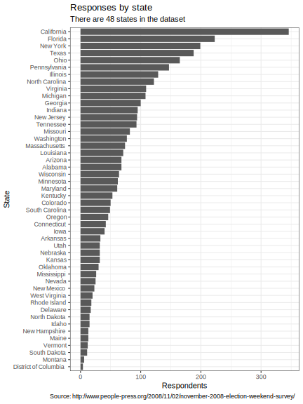
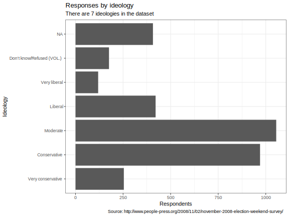
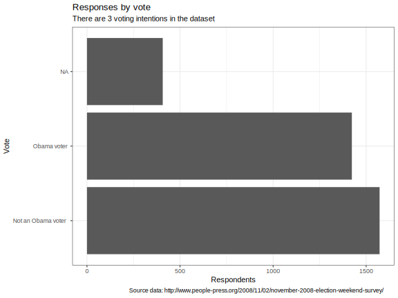
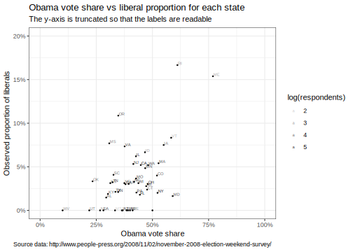
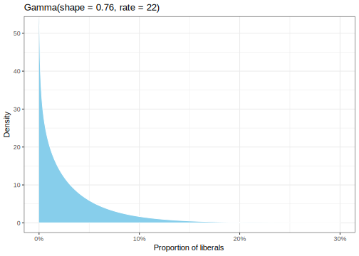
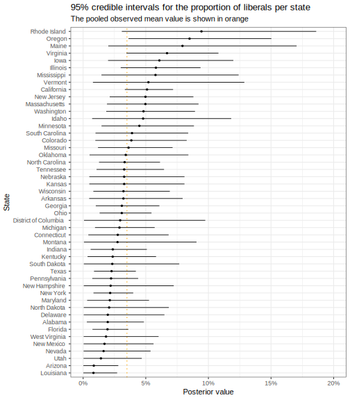
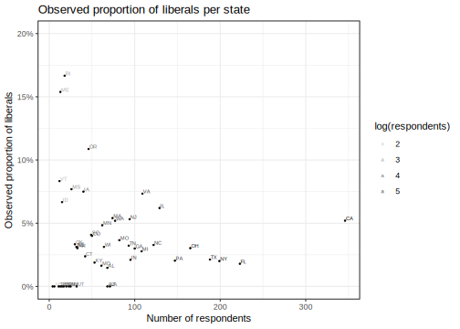
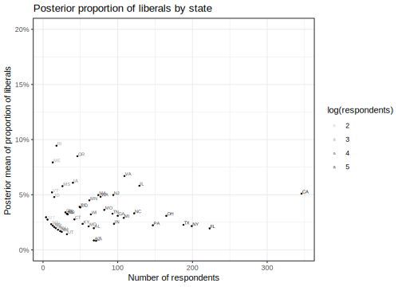

Here's my solution to exercise 21, chapter 2, of
[Gelman's](https://andrewgelman.com/) *Bayesian Data Analysis* (BDA),
3rd edition. There are
[solutions](http://www.stat.columbia.edu/~gelman/book/solutions.pdf) to
some of the exercises on the [book's
webpage](http://www.stat.columbia.edu/~gelman/book/).

<!--more-->
<div style="display:none">

$\DeclareMathOperator{\dbinomial}{Binomial}  \DeclareMathOperator{\dbern}{Bernoulli}  \DeclareMathOperator{\dpois}{Poisson}  \DeclareMathOperator{\dnorm}{Normal}  \DeclareMathOperator{\dcauchy}{Cauchy}  \DeclareMathOperator{\dexponential}{Exp}  \DeclareMathOperator{\dgamma}{Gamma}  \DeclareMathOperator{\dinvgamma}{InvGamma}  \DeclareMathOperator{\invlogit}{InvLogit}  \DeclareMathOperator{\logit}{Logit}  \DeclareMathOperator{\dbeta}{Beta}$

</div>

I wasn't able to find any of the data for this question on the book's
website (as indicated in the book). However, the data are available on
the [Pew Research Center
website](http://www.people-press.org/2008/11/02/november-2008-election-weekend-survey/).
I am unsure if the Pew version is the same as the version intended in
the book.

Data inspection
---------------

### Loading

Unzipping the download into my local `data` directory gives three files
of interest:

-   `ElectWkd08c.sav`

    The dataset in SPSS format.

-   `ElecWknd08.que.doc`

    A description of the survey questions and their column names in the
    dataset.

-   `readme.txt`

    A description of the columns in the dataset derived from the survey
    questions.

``` {.r}
library(foreign)

df0 <- read.spss(file = 'data/ElectWkd08c.sav') %>% 
  as_tibble()

df0 %>% nrow()
```

    [1] 3402

There are many columns.

``` {.r}
df0 %>% colnames()
```

      [1] "psraid"    "attempt"   "fcall"     "refusal"   "int_date" 
      [6] "area"      "scregion"  "sfips"     "sstate"    "cdist"    
     [11] "msa"       "usr"       "usr1"      "sampzip"   "pdsgen"   
     [16] "pdsrace"   "zfips"     "zstate"    "zcregion"  "zdensity3"
     [21] "sdensity3" "file"      "sample"    "sex"       "qs1"      
     [26] "thought"   "q1"        "voter"     "regist"    "regicert" 
     [31] "planreg"   "precinct"  "q2"        "oftvote"   "where"    
     [36] "horse"     "q3"        "q3_1"      "q3_2"      "q3_3"     
     [41] "q3a"       "q3a_1"     "q3a_2"     "q3a_3"     "q3summ"   
     [46] "q3summ2"   "q3tot"     "q3atot"    "q3horse"   "q3b"      
     [51] "q3bfilt"   "q5"        "q6"        "swing"     "plan1"    
     [56] "plan2"     "plan3"     "q7"        "q8"        "q9"       
     [61] "q10a"      "q10b"      "q10c"      "q10d"      "q10e"     
     [66] "q10f"      "q10g"      "q10de"     "q11"       "q12"      
     [71] "q13"       "q14"       "q15"       "q15_1"     "q15_2"    
     [76] "q15_3"     "Q15tot"    "q16"       "q16a"      "q17"      
     [81] "age"       "recage"    "educ"      "receduc"   "hisp1"    
     [86] "race_1"    "race_2"    "race_3"    "race_4"    "racecmb"  
     [91] "racethn"   "marital"   "parent"    "relig"     "religos"  
     [96] "chr"       "born"      "attend"    "income"    "party"    
    [101] "partyln"   "ideo"      "class"     "employ"    "pvote04a" 
    [106] "pvote04b"  "primary"   "first1"    "first2"    "scale10"  
    [111] "labor"     "ql1"       "ql2"       "qc1"       "qc2"      
    [116] "zipcode"   "money10"   "website"   "isex"      "ihisp1"   
    [121] "irace_1"   "irace_2"   "irace_3"   "irace_4"   "iraceth"  
    [126] "iracecmb"  "regfinal"  "ballot"    "mccain"    "obama"    
    [131] "sameday"   "battle"    "phoneuse"  "filter_$"  "lvs"      
    [136] "lvswt67"   "llweight"  "coweight"  "wt_weth"   "wt_thfr"  
    [141] "wt_frsa"   "wt_wefr"   "weight"    "unlvwt67" 

### State

For each state, we want to know how many label themselves as
`Very liberal` and how many report supporting Obama. The state is given
by the `sstate` column and doesn't include Hawaii or Alaska.

``` {.r}
df0 %>% 
  group_by(sstate) %>% 
  count() %>% 
  ggplot() +
  aes(reorder(sstate, n), n) +
  geom_col() +
  coord_flip() +
  labs(
    x = 'State',
    y = 'Respondents',
    title = 'Responses by state',
    subtitle = str_glue('There are {df0 %>% distinct(sstate) %>% nrow()} states in the dataset'),
    caption = 'Source: http://www.people-press.org/2008/11/02/november-2008-election-weekend-survey/'
  )
```



### Ideology

Consulting the documentation, we see that liberality is given by the
`ideo` column.

``` {.r}
df0 %>% 
  ggplot() +
  aes(ideo) +
  geom_bar() +
  coord_flip() +
  labs(
    x = 'Ideology',
    y = 'Respondents',
    title = 'Responses by ideology',
    subtitle = str_glue('There are {df0 %>% distinct(ideo) %>% nrow()} ideologies in the dataset'),
    caption = 'Source: http://www.people-press.org/2008/11/02/november-2008-election-weekend-survey/'
  )
```



### Obama voters

The data indicating vote is not so obvious. There is

-   current voting preference in question 3, of which there are
    different versions for different states;
-   there are various columns derived from the survey responses to
    question 3, such as `q3horse`;
-   there is question 6 which asks for voting intention in November; and
-   there is a column called `obama` for which I couldn't find any
    documentation.

Despite the lack of documentation, I'll run with `obama` since the
responses seem to align better with the purpose of the exercise.

``` {.r}
df0 %>% 
  ggplot() +
  aes(obama) +
  geom_bar() +
  coord_flip() +
  labs(
    x = 'Vote',
    y = 'Respondents',
    title = 'Responses by vote',
    subtitle = str_glue('There are {df0 %>% distinct(obama) %>% nrow()} voting intentions in the dataset'),
    caption = 'Source data: http://www.people-press.org/2008/11/02/november-2008-election-weekend-survey/'
  )
```



### Data augmentation

In order to display two-letter abbreviations of the states, we use the
data provided by the `state` package and join it to the Pew dataset.

``` {.r}
mapping <- tibble(
  name = as_factor(state.name, levels = levels(df$sstate)), 
  abbreviation = state.abb
)

df <- df0 %>% 
  left_join(mapping, by = c('sstate' = 'name'))
```

Here's a sample from the mapping table.

<table class="table table-striped table-hover table-condensed table-responsive" style="margin-left: auto; margin-right: auto;">
<thead>
<tr>
<th style="text-align:left;">
name
</th>
<th style="text-align:left;">
abbreviation
</th>
</tr>
</thead>
<tbody>
<tr>
<td style="text-align:left;">
Alabama
</td>
<td style="text-align:left;">
AL
</td>
</tr>
<tr>
<td style="text-align:left;">
Alaska
</td>
<td style="text-align:left;">
AK
</td>
</tr>
<tr>
<td style="text-align:left;">
Arizona
</td>
<td style="text-align:left;">
AZ
</td>
</tr>
<tr>
<td style="text-align:left;">
Arkansas
</td>
<td style="text-align:left;">
AR
</td>
</tr>
<tr>
<td style="text-align:left;">
California
</td>
<td style="text-align:left;">
CA
</td>
</tr>
<tr>
<td style="text-align:left;">
Colorado
</td>
<td style="text-align:left;">
CO
</td>
</tr>
</tbody>
</table>
Ideology vs. Obama voter
------------------------

### Raw proportions

Let's take a look at how the proportion of liberals relates to the
proportion of Obama voters. There seems to be a positive relation,
although the data are fairly noisy. Plotting the full range of values on
the y-axis makes the noise more prominent. We only show the resticted
range in order to show the individual state names.

``` {.r}
qa <- df %>% 
  group_by(sstate) %>% 
  summarise(
    respondents = n(),
    liberals = sum(ideo == 'Very liberal', na.rm = TRUE),
    liberal_proportion = liberals / respondents,
    obama_voters = sum(obama == 'Obama voter', na.rm = TRUE),
    obama_vote_share = obama_voters / respondents  
  ) %>% 
  left_join(mapping, by = c('sstate' = 'name'))

qa %>% 
  ggplot() +
  aes(y = liberal_proportion, x = obama_vote_share) +
  geom_point(size = 0.3) +
  geom_text(aes(label = abbreviation, alpha = log(respondents)), size = 2, hjust = -0.1, vjust = -0.1) +
  scale_x_continuous(labels = percent, limits = c(0, 1)) +
  scale_y_continuous(labels = percent, limits = c(0, 0.2)) +
  labs(
    y = 'Observed proportion of liberals',
    x = 'Obama vote share',
    title = 'Obama vote share vs liberal proportion for each state',
    subtitle = 'The y-axis is truncated so that the labels are readable',
    caption = 'Source data: http://www.people-press.org/2008/11/02/november-2008-election-weekend-survey/'
  )
```



### Posterior inference

We'll base our prior on the data (for convenience) and don't take survey
non-response issues into account. The pooled mean proportion of liberals
will be our prior mean.

``` {.r}
mu <- sum(df$ideo == 'Very liberal', na.rm = TRUE) / nrow(df)
percent(mu)
```

    [1] "3.5%"

After trying various possibilities for the standard deviation `sigma`,
the value below results in a prior that puts most of the density between
0% and 18%.

``` {.r}
sigma <- 0.04

shape <- (mu / sigma)^2
rate <- shape / mu

tibble(
    prop = seq(0, 0.5, 0.0005),
    density = dgamma(prop, shape, rate)
  ) %>% 
  ggplot() +
  aes(prop, density) +
  geom_area(fill = 'skyblue', colour = 'white') +
  scale_x_continuous(labels = percent, limits = c(0, 0.3)) +
  labs(
    x = 'Proportion of liberals',
    y = 'Density',
    title = str_glue(paste(
      'Gamma(shape = {signif(shape, digits = 2)}, rate = {signif(rate, digits = 2)})',
      sep = '\n'
    ))
  )
```



Let's add the posterior means to our dataset and plot the them against
proportion of Obama voters. In order to be visually comparable to the
plot of observed data, we keep the limits of the axes the same.

``` {.r}
qa_posterior <- qa %>% 
  mutate(
    posterior_shape = shape + liberals,
    posterior_rate = rate + respondents,
    posterior_mean = posterior_shape / posterior_rate
  )

qa_posterior %>% 
  ggplot() +
  aes(y = posterior_mean, x = obama_vote_share) +
  geom_point(size = 0.3) +
  geom_text(aes(label = abbreviation, alpha = log(respondents)), size = 2, hjust = -0.1, vjust = -0.1) +
  scale_x_continuous(labels = percent, limits = c(0, 1)) +
  scale_y_continuous(labels = percent, limits = c(0, 0.2)) +
  labs(
    y = 'Posterior mean of proportion of liberals',
    x = 'Obama vote share',
    title = 'Obama vote share vs estimate of liberal proportion'
  )
```


The posterior 95% credible intervals are shown below. Arizona and
Louisianna seem to have a smaller proportional of liberals compared to
the country average. Only Oregon's credible interval is entirely above
the country average.

``` {.r}
qa_posterior %>% 
  mutate(
    ci = map2(
      posterior_shape, 
      posterior_rate, 
      function(s, r) 
        tibble(
          type = c('lower', 'upper'),
          value = qgamma(c(0.05, 0.95), s, r)
        ) 
    )
  ) %>% 
  unnest(ci) %>% 
  spread(type, value) %>% 
  ggplot() +
  geom_hline(yintercept = mu, linetype = 'dotted', colour = 'orange') +
  aes(reorder(sstate, posterior_mean), posterior_mean) +
  geom_pointrange(aes(ymin = lower, ymax = upper), fatten = 0.1, size = 0.4)  +
  scale_y_continuous(labels = percent, limits = c(0, 0.2)) +
  coord_flip() +
  labs(
    y = 'Posterior value',
    x = 'State',
    title = '95% credible intervals for the proportion of liberals per state',
    subtitle = 'The pooled observed mean value is shown in orange'
  )
```



All of the states in which no liberals were observed had smaller sample
sizes (below 50). The largest proportions were also observed in the
states with sample sizes below 50. This plot looks fairly similar to the
analogous plot for the cancer rate example, albeit with fewer data
points.

``` {.r}
qa %>% 
  ggplot() +
  aes(respondents, liberal_proportion) +
  geom_point(size = 0.3) +
  geom_text(aes(label = abbreviation, alpha = log(respondents)), size = 2, hjust = -0.1, vjust = -0.1) +
  scale_y_continuous(labels = percent, limits = c(0, 0.2)) +
  labs(
    x = 'Number of respondents',
    y = 'Observed proportion of liberals',
    title = 'Observed proportion of liberals per state'
  )
```



The posterior estimates result in much less extreme values for the
states with few respondents.

``` {.r}
qa_posterior %>% 
  ggplot() +
  aes(respondents, posterior_mean) +
  geom_point(size = 0.3) +
  geom_text(aes(label = abbreviation, alpha = log(respondents)), size = 2, hjust = -0.1, vjust = -0.1) +
  scale_y_continuous(labels = percent, limits = c(0, 0.2)) +
  labs(
    x = 'Number of respondents',
    y = 'Posterior mean of proportion of liberals',
    title = 'Posterior proportion of liberals by state'
  )
```


