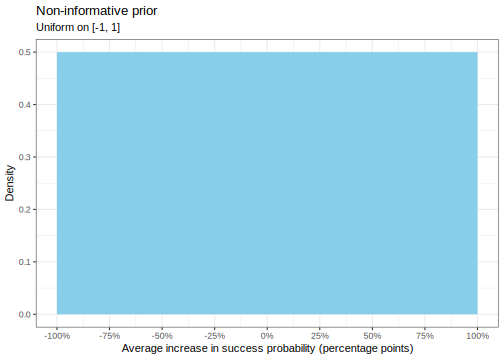
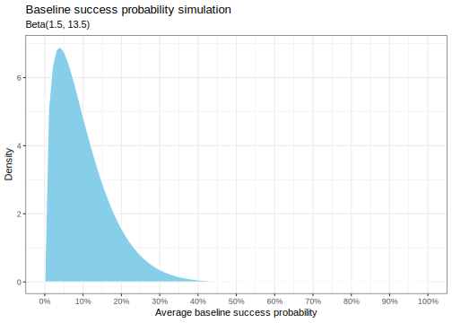
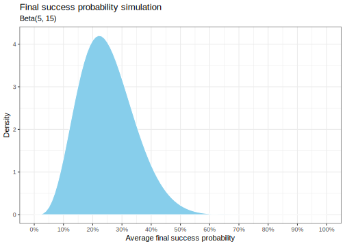
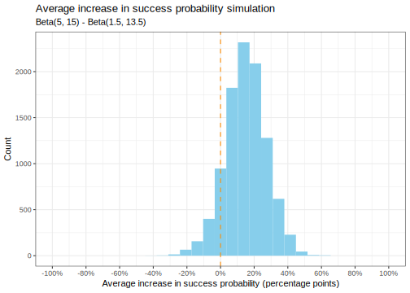
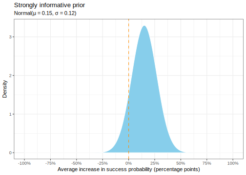
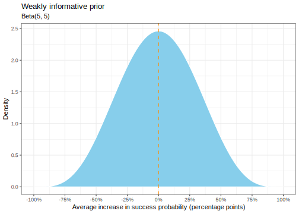

Here's my solution to exercise 22, chapter 2, of
[Gelman's](https://andrewgelman.com/) *Bayesian Data Analysis* (BDA),
3rd edition. There are
[solutions](http://www.stat.columbia.edu/~gelman/book/solutions.pdf) to
some of the exercises on the [book's
webpage](http://www.stat.columbia.edu/~gelman/book/).

<!--more-->
<div style="display:none">

$\DeclareMathOperator{\dbinomial}{Binomial}  \DeclareMathOperator{\dbern}{Bernoulli}  \DeclareMathOperator{\dpois}{Poisson}  \DeclareMathOperator{\dnorm}{Normal}  \DeclareMathOperator{\dcauchy}{Cauchy}  \DeclareMathOperator{\dexponential}{Exp}  \DeclareMathOperator{\dgamma}{Gamma}  \DeclareMathOperator{\dinvgamma}{InvGamma}  \DeclareMathOperator{\invlogit}{InvLogit}  \DeclareMathOperator{\logit}{Logit}  \DeclareMathOperator{\dbeta}{Beta}$

</div>

Suppose you have a random sample of 100 college students in a basketball
study. Each student takes 100 free-throws to establish a baseline
success probability, $\phi_0$. The students then take 50 practice
free-throws per day for a month. After this month is up, each takes 100
shots for a final measurement of success probability, $\phi_1$. We wish
to estimate the increase in success probability,
$\theta := \phi_1 - \phi_0$.

We could use the uniform distribution on the range of theoretically
possible values $[-1, 1]$ as a 'non-informative' prior, i.e. every level
of increase is equally likely.



To construct an informative prior, I had to do a bit of background
reading as I have next to zero basketball knowledge. After some
google-fu, it seems the [best of the
best](https://www.basketball-reference.com/leaders/ft_pct_career.html)
have a free-throw success rate of around 80-90%, and the [worst of the
best](https://abcnews.go.com/Sports/free-throws-easy-consequences-failing/story?id=40769445)
around 50-60%. This latter estimate probably lies on the upper extreme
for random college students. From watching some [free throw
videos](https://www.youtube.com/watch?v=LFF6_5hyokU), I would guess that
I would have a success rate of about 10% (baseline).

Let's model the baseline average as beta distributed around a mean of
10% and upper extreme below 40%.

``` {.r}
mu0 <- 0.10
n0 <- 15

alpha0 <- mu0 * n0
beta0 <- (1 - mu0) * n0

tibble(
    p = seq(0, 1, 0.01),
    density = dbeta(p, alpha0, beta0)
  ) %>% 
  ggplot() + 
  aes(p, density) +
  geom_area(fill = 'skyblue', colour = 'white') +
  scale_x_continuous(labels = percent, breaks = seq(0, 1, 0.1)) +
  labs(
    x = 'Average baseline success probability',
    y = 'Density',
    title = 'Baseline success probability simulation',
    subtitle = str_glue('Beta({alpha0}, {beta0})')
  )
```



With this assumption, there is a 0.286% chance of an average above 40%.

For the final estimate, the improvement could be quite significant given
that random students are likely untrained (the better you get, the
harder it is to improve). An average 15%% improvement seems plausible to
me.

``` {.r}
mu1 <- mu0 + 0.15
n1 <- 20

alpha1 <- mu1 * n1
beta1 <- (1 - mu1) * n1

tibble(
    p = seq(0, 1, 0.01),
    density = dbeta(p, alpha1, beta1)
  ) %>% 
  ggplot() + 
  aes(p, density) +
  geom_area(fill = 'skyblue', colour = 'white') +
  scale_x_continuous(labels = percent, breaks = seq(0, 1, 0.1)) +
  labs(
    x = 'Average final success probability',
    y = 'Density',
    title = 'Final success probability simulation',
    subtitle = str_glue('Beta({alpha1}, {beta1})')
  )
```



With the above assumptions, the distribution of the average increase is
shown below. The bulk of the mass is above 0, which makes sense as most
should improve through practice. There is also some chance of a
decrease, with -25%% being fairly extreme.

``` {.r}
increase <- tibble(
    phi0 = rbeta(10000, alpha0, beta0),
    phi1 = rbeta(10000, alpha1, beta1),
    theta = phi1 - phi0
  ) 

increase %>% 
  ggplot() + 
  aes(theta) +
  geom_histogram(fill = 'skyblue') +
  geom_vline(xintercept = 0, colour = 'dark orange', linetype = 'dashed') +
  scale_x_continuous(labels = percent, breaks = seq(-1, 1, 0.2), limits = c(-1, 1)) +
  labs(
    x = 'Average increase in success probability (percentage points)',
    y = 'Count',
    title = 'Average increase in success probability simulation',
    subtitle = str_glue('Beta({alpha1}, {beta1}) - Beta({alpha0}, {beta0})')
  )
```



We could approximate this as a beta distribution on $[-1, 1]$ to ensure
the prior is bounded. In this case, we can probably get away with using
a normal distribution since the probability of exceeding the bounds is
negligible.

``` {.r}
mu <- mu1 - mu0
sigma <- sd(increase$theta)

tibble(
    theta = seq(-1, 1, 0.01),
    density = dnorm(theta, mu, sigma)
  ) %>% 
  ggplot() +
  aes(theta, density) +
  geom_area(fill = 'skyblue', colour = 'white') +
  geom_vline(xintercept = 0, colour = 'dark orange', linetype = 'dashed') +
  scale_x_continuous(labels = percent, breaks = seq(-1, 1, 0.25)) +
  labs(
    x = 'Average increase in success probability (percentage points)',
    y = 'Density',
    title = 'Strongly informative prior',
    subtitle = str_glue('Normal(μ = {signif(mu, digits = 2)}, σ = {signif(sigma, digits = 2)})')
  ) +
  NULL
```



The probability that this normal distribution exceeds 1 is
0.000000000104%. A subjective prior for the average increase in success
probability would thus be a $\dnorm(0.15, 0.12)$ prior.

Finally, let's construct a weakly informative prior. We'll again use the
beta distribution scaled to the interval $[-1, 1]$, with a mean of 0 so
that an increase can be entirely attributed to the data and not to the
prior. Since the best of the pros have a success probability around 90%,
we'd expect the increase of 100 random students to be below this value.

``` {.r}
alpha <- 5
beta <- 5

tibble(
    theta = seq(-1, 1, 0.01),
    density = dbeta(0.5 + theta / 2, alpha, beta)
  ) %>% 
  ggplot() +
  aes(theta, density) +
  geom_area(fill = 'skyblue', colour = 'white') +
  geom_vline(xintercept = 0, colour = 'dark orange', linetype = 'dashed') +
  scale_x_continuous(breaks = seq(-1, 1, 0.25), labels = percent) +
  labs(
    x = 'Average increase in success probability (percentage points)',
    y = 'Density',
    title = 'Weakly informative prior',
    subtitle = str_glue('Beta({alpha}, {beta})')
  ) +
  NULL
```


