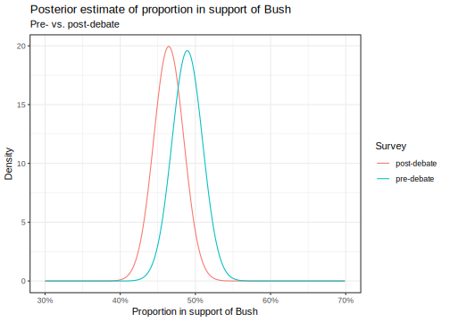
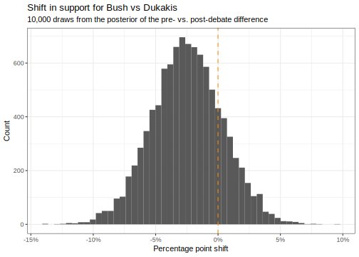

Here's my solution to exercise 2, chapter 3, of
[Gelman's](https://andrewgelman.com/) *Bayesian Data Analysis* (BDA),
3rd edition. There are
[solutions](http://www.stat.columbia.edu/~gelman/book/solutions.pdf) to
some of the exercises on the [book's
webpage](http://www.stat.columbia.edu/~gelman/book/).

<!--more-->
<div style="display:none">

$\DeclareMathOperator{\dbinomial}{Binomial}  \DeclareMathOperator{\dbern}{Bernoulli}  \DeclareMathOperator{\dpois}{Poisson}  \DeclareMathOperator{\dnorm}{Normal}  \DeclareMathOperator{\dcauchy}{Cauchy}  \DeclareMathOperator{\dexponential}{Exp}  \DeclareMathOperator{\dgamma}{Gamma}  \DeclareMathOperator{\dinvgamma}{InvGamma}  \DeclareMathOperator{\invlogit}{InvLogit}  \DeclareMathOperator{\logit}{Logit}  \DeclareMathOperator{\ddirichlet}{Dirichlet}  \DeclareMathOperator{\dbeta}{Beta}$

</div>

<table class="table table-striped table-hover table-responsive" style="margin-left: auto; margin-right: auto;">
<thead>
<tr>
<th style="text-align:left;">
survey
</th>
<th style="text-align:right;">
bush
</th>
<th style="text-align:right;">
dukakis
</th>
<th style="text-align:right;">
other
</th>
<th style="text-align:right;">
total
</th>
</tr>
</thead>
<tbody>
<tr>
<td style="text-align:left;">
pre-debate
</td>
<td style="text-align:right;">
294
</td>
<td style="text-align:right;">
307
</td>
<td style="text-align:right;">
38
</td>
<td style="text-align:right;">
639
</td>
</tr>
<tr>
<td style="text-align:left;">
post-debate
</td>
<td style="text-align:right;">
288
</td>
<td style="text-align:right;">
332
</td>
<td style="text-align:right;">
19
</td>
<td style="text-align:right;">
639
</td>
</tr>
</tbody>
</table>
Let $\theta_\text{pre} \sim \ddirichlet_3(\alpha_\text{pre})$ and
$\theta_\text{post} \sim \ddirichlet_3(\alpha_\text{post})$ be the pre-
and post-debate priors. Then the posteriors are

$$
\begin{align}
  \theta_\text{pre} \mid y &\sim \ddirichlet\left(294 + \alpha_{(\text{pre}, \text{b})}, 307 + \alpha_{(\text{pre}, \text{d})}, 38 + \alpha_{(\text{pre}, \text{o})} \right)
  \\
  \theta_\text{post} \mid y &\sim \ddirichlet\left(288 + \alpha_{(\text{post}, \text{b})}, 332 + \alpha_{(\text{post}, \text{d})}, 19 + \alpha_{(\text{post}, \text{o})} \right)
.
\end{align}
$$

Denote the proportion of support for Bush amongst Bush/Dukakis
supporters by
$\phi_\bullet := \frac{\theta_{(\bullet, \text{b})}}{\theta_{(\bullet, \text{b})} + \theta_{(\bullet, \text{d})}}$.
The results of the [previous exercise](./chapter_03_exercise_01.html)
show that we can treat this as a beta-binomial problem by simply
ignoring the results for `other`. More precisely,

$$
\begin{align}
  \phi_\text{pre} \mid y &\sim \dbeta\left(294 + \alpha_{(\text{pre}, \text{b})}, 307 + \alpha_{(\text{pre}, \text{d})} \right)
  \\
  \phi_\text{post} \mid y &\sim \dbeta\left(288 + \alpha_{(\text{post}, \text{b})}, 332 + \alpha_{(\text{post}, \text{d})} \right)
\end{align}
.
$$

Let's plot these posteriors and their difference
$\delta := (\phi_\text{post} \mid y) - (\phi_\text{pre} \mid y)$.

``` {.r}
alpha_bush <- 1
alpha_dukakis <- 1

posteriors <- expand.grid(
    value = seq(0, 1, 0.001),
    survey = df$survey
  ) %>% 
  as_tibble() %>% 
  inner_join(df, by = 'survey') %>% 
  mutate(
    post_bush = bush + alpha_bush,
    post_dukakis = dukakis + alpha_dukakis,
    density = dbeta(value, post_bush, post_dukakis)
  ) 
```



``` {.r}
N <- 10000

shift <- expand.grid(
    draw = 1:N, 
    survey = df$survey
  ) %>% 
  as_tibble() %>% 
  inner_join(df, by = 'survey') %>% 
  mutate(
    post_bush = bush + alpha_bush,
    post_dukakis = dukakis + alpha_dukakis,
    value = rbeta(n(), post_bush, post_dukakis)
  ) %>% 
  select(draw, survey, value) %>% 
  spread(survey, value) %>% 
  mutate(difference = `post-debate` - `pre-debate`) 
```



There is a 19% probability (the area above 0) that there was a positive
shift towards Bush.
