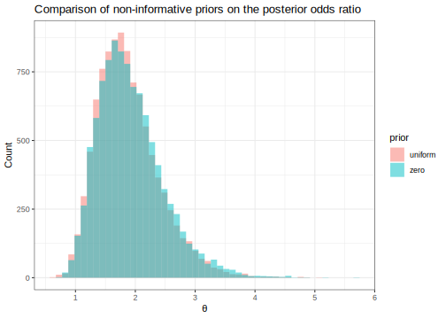

Here's my solution to exercise 4, chapter 3, of
[Gelman's](https://andrewgelman.com/) *Bayesian Data Analysis* (BDA),
3rd edition. There are
[solutions](http://www.stat.columbia.edu/~gelman/book/solutions.pdf) to
some of the exercises on the [book's
webpage](http://www.stat.columbia.edu/~gelman/book/).

<!--more-->
<div style="display:none">

$\DeclareMathOperator{\dbinomial}{Binomial}  \DeclareMathOperator{\dbern}{Bernoulli}  \DeclareMathOperator{\dpois}{Poisson}  \DeclareMathOperator{\dnorm}{Normal}  \DeclareMathOperator{\dt}{t}  \DeclareMathOperator{\dcauchy}{Cauchy}  \DeclareMathOperator{\dexponential}{Exp}  \DeclareMathOperator{\dgamma}{Gamma}  \DeclareMathOperator{\dinvgamma}{InvGamma}  \DeclareMathOperator{\invlogit}{InvLogit}  \DeclareMathOperator{\logit}{Logit}  \DeclareMathOperator{\ddirichlet}{Dirichlet}  \DeclareMathOperator{\dbeta}{Beta}$

</div>

Suppose we have two independent trials where the likelihood of death is
binomial, $y_i \mid p_0, p_1 \sim \dbinomial(n_i, p_i)$, $i = 0, 1$. We
will compare two different non-informative priors on the odds ratio

$$
\theta
:=
\frac{p_0}{1 - p_0} / \frac{p_1}{1 - p_1} 
.
$$

Here are the given data.

``` {.r}
df <- tibble(
    cohort = c('control', 'treatment'),
    patients = c(674, 680),
    deaths = c(39, 22)
  ) %>% 
  mutate(survived = patients - deaths)
```

<table class="table" style="margin-left: auto; margin-right: auto;">
<thead>
<tr>
<th style="text-align:left;">
cohort
</th>
<th style="text-align:right;">
patients
</th>
<th style="text-align:right;">
deaths
</th>
<th style="text-align:right;">
survived
</th>
</tr>
</thead>
<tbody>
<tr>
<td style="text-align:left;">
control
</td>
<td style="text-align:right;">
674
</td>
<td style="text-align:right;">
39
</td>
<td style="text-align:right;">
635
</td>
</tr>
<tr>
<td style="text-align:left;">
treatment
</td>
<td style="text-align:right;">
680
</td>
<td style="text-align:right;">
22
</td>
<td style="text-align:right;">
658
</td>
</tr>
</tbody>
</table>
We'll need a couple of functions for drawing random samples for
$\theta$.

``` {.r}
odds <- function(p) p / (1 - p)

simulate <- function(n, k, a, b, draws = 10000)
  # draws from posterior
  # n bernouille trials, k successes with beta(a, b) prior
  tibble(
    draw = 1:draws, 
    value = rbeta(draws, k + a, n - k + b)
  )

posterior <- function(a, b, draws = 10000)
  # random samples from theta posterior with beta(a, b) prior
  df %>% 
    transmute(
      cohort,
      draws = map2(patients, deaths, simulate, a, b, draws)
    ) %>% 
    unnest(draws) %>% 
    spread(cohort, value) %>% 
    mutate(theta = odds(control) / odds(treatment))
```

Let's compare a uniform prior to a prior close to $\dbeta(0, 0)$.

``` {.r}
uni <- posterior(1, 1) %>% 
  mutate(prior = 'uniform')

zero <- posterior(0.000000001, 0.000000001) %>% 
  mutate(prior = 'zero')

posteriors <- bind_rows(uni, zero)
```



Here are the 95% posterior credible intervals for $\theta$.

``` {.r}
cis <- posteriors %>% 
  group_by(prior) %>% 
  summarise(
    q05 = quantile(theta, 0.05),
    q50 = quantile(theta, 0.5),
    q95 = quantile(theta, 0.95)
  )
```

<table class="table" style="margin-left: auto; margin-right: auto;">
<thead>
<tr>
<th style="text-align:left;">
prior
</th>
<th style="text-align:right;">
q05
</th>
<th style="text-align:right;">
q50
</th>
<th style="text-align:right;">
q95
</th>
</tr>
</thead>
<tbody>
<tr>
<td style="text-align:left;">
uniform
</td>
<td style="text-align:right;">
1.167356
</td>
<td style="text-align:right;">
1.808981
</td>
<td style="text-align:right;">
2.859778
</td>
</tr>
<tr>
<td style="text-align:left;">
zero
</td>
<td style="text-align:right;">
1.190899
</td>
<td style="text-align:right;">
1.845182
</td>
<td style="text-align:right;">
2.939430
</td>
</tr>
</tbody>
</table>
The estimates with the "zero" prior are slightly higher than those from
the uniform prior, especially in the tails.
