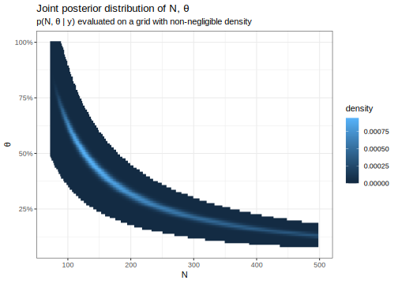
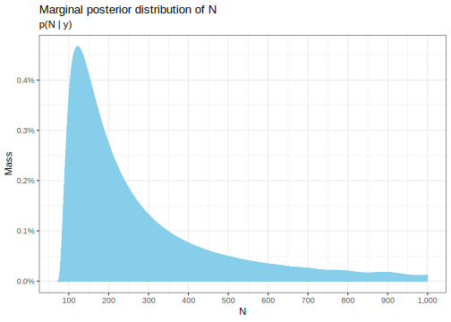

Here's my solution to exercise 6, chapter 3, of
[Gelman's](https://andrewgelman.com/) *Bayesian Data Analysis* (BDA),
3rd edition. There are
[solutions](http://www.stat.columbia.edu/~gelman/book/solutions.pdf) to
some of the exercises on the [book's
webpage](http://www.stat.columbia.edu/~gelman/book/).

<!--more-->
<div style="display:none">

$\DeclareMathOperator{\dbinomial}{Binomial}  \DeclareMathOperator{\dbern}{Bernoulli}  \DeclareMathOperator{\dpois}{Poisson}  \DeclareMathOperator{\dnorm}{Normal}  \DeclareMathOperator{\dt}{t}  \DeclareMathOperator{\dcauchy}{Cauchy}  \DeclareMathOperator{\dexponential}{Exp}  \DeclareMathOperator{\duniform}{Uniform}  \DeclareMathOperator{\dgamma}{Gamma}  \DeclareMathOperator{\dinvgamma}{InvGamma}  \DeclareMathOperator{\invlogit}{InvLogit}  \DeclareMathOperator{\logit}{Logit}  \DeclareMathOperator{\ddirichlet}{Dirichlet}  \DeclareMathOperator{\dbeta}{Beta}$

</div>

Theory
------

Suppose we have binomial data where both the number of trials $N$ and
the success rate $\theta$ are unknown and to be estimated.
[Rafferty](http://pluto.huji.ac.il/~galelidan/52558/Material/Raftery.pdf)
suggests the following hierarchical model:

$$
\begin{align}
  y \mid N, \theta &\sim \dbinomial(N, \theta)
  \\
  \theta &\sim \duniform(0, 1)
  \\
  N \mid \mu &\sim \dpois(\mu)
\end{align}
$$

where the parameter $\mu$ is also unknown. Instead of putting a prior on
$\mu$, it is suggested to define

$$
\begin{align}
  \lambda &:= \mu \theta
  \\
  p(\lambda) &\propto \frac{1}{\lambda}
\end{align}
$$

and to put a prior on $\lambda$. This is advantageous since $\lambda$ is
the expected number of successes, which is easier to reason about than
$N$ since we can actually observe it. The hierarchical structure allows
us to be vague about the prior magnitude of $N$; an unconditional
Poisson prior on $N$ could be a good idea if we had reason to believe it
lies in the plausible range as defined by that prior. It is improper
since its integral is the logarithm evaluated where it goes to infinity.

Let's find the corresponding prior on $N$. First note that

$$
\begin{align}
  p(\mu, \theta)
  &\propto
  p(\lambda, \theta) \cdot
  \begin{vmatrix}
    \theta & \mu \\
    0 & 1
  \end{vmatrix}
  \\
  &=
  \frac{1}{\lambda}
  \cdot
  \theta
  \\
  &=
  \frac{1}{\mu}.
\end{align}
$$

It follows that $p(\mu) \propto \mu^{-1}$. Thus,

\begin{align}
  p(N, \mu)
  &=
  p(N \mid \mu) p(\mu)
  \\
  &\propto
  \frac{\mu^N e^{-\mu}}{N!}\frac{1}{\mu}
  \\
  &=
  \frac{\mu^{N-1} e^{-\mu}}{N!}
  
\end{align}
From the definition of the [Gamma
function](https://en.wikipedia.org/wiki/Gamma_function#Main_definition),
it follows that

$$
\begin{align}
  p(N)
  &\propto
  \int_0^\infty \frac{\mu^{N-1} e^{-\mu}}{N!} d\mu
  \\
  &=
  \frac{1}{N!} \Gamma (N)
  \\
  &=
  \frac{1}{N!} (N - 1)!
  \\
  &=
  \frac{1}{N}
  .
\end{align}
$$

The joint posterior is

$$
p(N, \theta \mid y)
\propto
\frac{1}{N}\cdot \prod_{i = 1}^n \binom{N}{y_i} \cdot \theta^{\sum_{i = 1}^n y_i} (1 - \theta)^{nN - \sum_{i = 1}^n y_i}
.
$$

and the marginal posterior is

$$
\begin{align}
  p(N \mid y)
  &=
  \int_0^1
  p(N, \theta \mid y) d\theta
  \\
  &\propto
  \frac{1}{N}\cdot \prod_{i = 1}^n \binom{N}{y_i} 
  \int_0^1 \theta^{\sum_{i = 1}^n y_i} (1 - \theta)^{nN - \sum_{i = 1}^n y_i} d\theta
  \\
  &=
  \frac{1}{N}\cdot \prod_{i = 1}^n \binom{N}{y_i} 
  \cdot
  \frac{\Gamma(1 + \sum_1^n y_i)\Gamma(1 + nN - \sum_1^n y_i)}{\Gamma(2 + nN)}
  \\
  &=
  \frac{1}{N}\cdot \prod_{i = 1}^n \binom{N}{y_i} 
  \cdot
  \frac{\left( \sum_1^n y_i \right)!\left( nN - \sum_1^n y_i \right)!}{(1 + nN)!}
\end{align}
$$

Example
-------

Suppose we observe the following counts.

``` {.r}
counts <- tibble(count = c(53, 57, 66, 67, 72))
```

We'd like to estimate the probability that $N > 100$. Stan can't help us
here because the algorithm it uses requires parameters to be continuous.
I learned a lot from approximating the posterior on a suitable grid, so
let's do that.

Here's our first computational problem: overflow.

``` {.r}
counts$count %>% 
  sum() %>% 
  factorial() %>% 
  log()
```

    Warning in factorial(.): value out of range in 'gammafn'

    [1] Inf

The factorial function gets big very fast, but computers can only deal
with a finite range. John Cook has a [very useful
post](https://www.johndcook.com/blog/2010/08/16/how-to-compute-log-factorial/)
with several solutions to get around this problem. I couldn't find a
definitive answer on how to make efficient hash tables in base R, so
I'll just use vectors.

``` {.r}
# slow but exact
logfactorial0 <- function(k)
  1:k %>% 
    log() %>% 
    sum()

# precalculated values
lookup <- 1:256 %>% 
  map(logfactorial0)

# stirling approximation
stirling <- function(k) 
  (k + 0.5) * log(k) - k + 0.5 * log(2 * pi) + 1 / (12 * k)

# 'efficient' implementation
logfactorial <- function(k) {
  if (k == 0) {
    result <- 0
  } else if (k <= 256) {
    result <- lookup[[k]]
  } else {
    result <- stirling(k)
  }
  return(result)
}
```

To convince ourselves our functions work correctly, we can look at a few
examples.

``` {.r}
1:4 %>% 
  map(logfactorial) %>% 
  map(exp)
```

    [[1]]
    [1] 1

    [[2]]
    [1] 2

    [[3]]
    [1] 6

    [[4]]
    [1] 24

Now we can calculate the log of the factorial. The factorial itself
though is still too large to be represented as a finite number.

``` {.r}
counts$count %>% 
  sum() %>% 
  logfactorial()
```

    [1] 1500.856

The log-factorial is enough for us to calculate the (unnormalised)
log-density.

``` {.r}
util <- function(N)
  counts %>% 
    mutate(
      logfac = map(count, logfactorial) %>% unlist(),
      nlogfac = map(N - count, logfactorial) %>% unlist(),
      logperm = logfactorial(N) - logfac - nlogfac
    ) %>% 
    summarise(
      n = n(),
      sum_count = sum(count),
      sum_logperm = sum(logperm),
      max_count = max(count)
    ) %>% 
    as.list()
  
joint_posterior <- function(N, theta) {
  p <- util(N)
  if (N < p$max_count) {
    density <- 0
  } else {
    logdensity <- -log(N) + p$sum_logperm + p$sum_count * log(theta) + (p$n * N - p$sum_count) * log(1 - theta)
    density <- exp(logdensity)
  }
  return(density)
}
```

In order to approximate the posterior on a grid, we need a suitable
grid. It's only worth calculating this where the posterior is
non-negligible. For a given $N$, the posterior can only have
non-negligible density when $\theta N$ is near the range 50-75. We'll
broaden that a bit and restrict it to be in the range 35-90.

``` {.r}
grid_joint <- expand.grid(
    N = max(counts$count):5000,
    theta = seq(0, 1, 0.01)
  ) %>% 
  as_tibble() %>% 
  filter(35 < N * theta & N * theta < 90) %>% 
  mutate(
    unnormalised_density = map2(N, theta, joint_posterior) %>% unlist(),
    normalising_constant = sum(unnormalised_density),
    density = unnormalised_density / normalising_constant
  ) %>% 
  select(-unnormalised_density, -normalising_constant)
```



We can also calculate the marginal posterior of $N$.

``` {.r}
marginal <- grid_joint %>% 
  group_by(N) %>% 
  summarise(mass = sum(density)) 
```



The posterior probability that $N > 100$ is then:

``` {.r}
grid_joint %>% 
  filter(N > 100) %>% 
  summarise(mass = sum(density)) %>% 
  pull() %>% 
  percent()
```

    [1] "95.6%"
