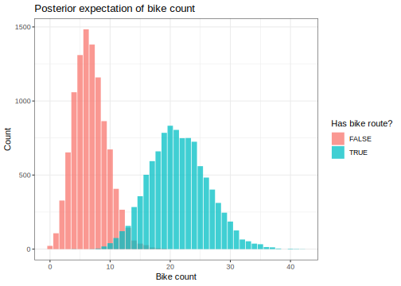
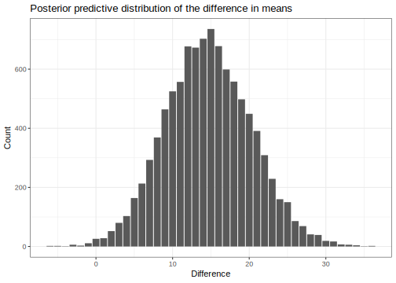

Here's my solution to exercise 8, chapter 3, of
[Gelman's](https://andrewgelman.com/) *Bayesian Data Analysis* (BDA),
3rd edition. There are
[solutions](http://www.stat.columbia.edu/~gelman/book/solutions.pdf) to
some of the exercises on the [book's
webpage](http://www.stat.columbia.edu/~gelman/book/).

<!--more-->
<div style="display:none">

$\DeclareMathOperator{\dbinomial}{Binomial}  \DeclareMathOperator{\dbern}{Bernoulli}  \DeclareMathOperator{\dpois}{Poisson}  \DeclareMathOperator{\dnorm}{Normal}  \DeclareMathOperator{\dt}{t}  \DeclareMathOperator{\dcauchy}{Cauchy}  \DeclareMathOperator{\dexponential}{Exp}  \DeclareMathOperator{\duniform}{Uniform}  \DeclareMathOperator{\dgamma}{Gamma}  \DeclareMathOperator{\dinvgamma}{InvGamma}  \DeclareMathOperator{\invlogit}{InvLogit}  \DeclareMathOperator{\logit}{Logit}  \DeclareMathOperator{\ddirichlet}{Dirichlet}  \DeclareMathOperator{\dbeta}{Beta}$

</div>

You can download the [full dataset shown in table
3.3](data/chapter_03_exercise_08.csv). Let's load it into a dataframe
and select just the residential data, as suggested.

``` {.r}
df0 <- read_csv('data/chapter_03_exercise_08.csv') %>% 
  mutate(
    type = as_factor(
      type, 
      levels = c('residential', 'fairly_busy', 'busy'), 
      ordered = TRUE
    ),
    bikes = as.integer(bikes),
    other = as.integer(other)
  )

df <- df0 %>% 
  filter(type == 'residential') %>% 
  mutate(
    total = bikes + other,
    bike_fraction = bikes / total,
    other_fraction = other / total
  )
```

Here are the first few rows with each value of `bike_route`.

<table class="table table-hover table-striped table-responsive" style="margin-left: auto; margin-right: auto;">
<thead>
<tr>
<th style="text-align:left;">
type
</th>
<th style="text-align:left;">
bike\_route
</th>
<th style="text-align:right;">
bikes
</th>
<th style="text-align:right;">
other
</th>
<th style="text-align:right;">
total
</th>
<th style="text-align:right;">
bike\_fraction
</th>
<th style="text-align:right;">
other\_fraction
</th>
</tr>
</thead>
<tbody>
<tr>
<td style="text-align:left;">
residential
</td>
<td style="text-align:left;">
TRUE
</td>
<td style="text-align:right;">
16
</td>
<td style="text-align:right;">
58
</td>
<td style="text-align:right;">
74
</td>
<td style="text-align:right;">
0.2162162
</td>
<td style="text-align:right;">
0.7837838
</td>
</tr>
<tr>
<td style="text-align:left;">
residential
</td>
<td style="text-align:left;">
TRUE
</td>
<td style="text-align:right;">
9
</td>
<td style="text-align:right;">
90
</td>
<td style="text-align:right;">
99
</td>
<td style="text-align:right;">
0.0909091
</td>
<td style="text-align:right;">
0.9090909
</td>
</tr>
<tr>
<td style="text-align:left;">
residential
</td>
<td style="text-align:left;">
TRUE
</td>
<td style="text-align:right;">
10
</td>
<td style="text-align:right;">
48
</td>
<td style="text-align:right;">
58
</td>
<td style="text-align:right;">
0.1724138
</td>
<td style="text-align:right;">
0.8275862
</td>
</tr>
<tr>
<td style="text-align:left;">
residential
</td>
<td style="text-align:left;">
FALSE
</td>
<td style="text-align:right;">
12
</td>
<td style="text-align:right;">
113
</td>
<td style="text-align:right;">
125
</td>
<td style="text-align:right;">
0.0960000
</td>
<td style="text-align:right;">
0.9040000
</td>
</tr>
<tr>
<td style="text-align:left;">
residential
</td>
<td style="text-align:left;">
FALSE
</td>
<td style="text-align:right;">
1
</td>
<td style="text-align:right;">
18
</td>
<td style="text-align:right;">
19
</td>
<td style="text-align:right;">
0.0526316
</td>
<td style="text-align:right;">
0.9473684
</td>
</tr>
<tr>
<td style="text-align:left;">
residential
</td>
<td style="text-align:left;">
FALSE
</td>
<td style="text-align:right;">
2
</td>
<td style="text-align:right;">
14
</td>
<td style="text-align:right;">
16
</td>
<td style="text-align:right;">
0.1250000
</td>
<td style="text-align:right;">
0.8750000
</td>
</tr>
</tbody>
</table>
We'll use an uninformative gamma prior with a Poisson likelihood for the
counts. The posterior can then be calculated as follows.

``` {.r}
draws <- 10000

shape_prior <- 2
rate_prior <- 0

posterior <- function(data, draws = 10000) {
  
  bikes <- data %>% pull(bikes)
  other <- data %>% pull(other)
  n <- data %>% pull(n)
  
  tibble(draw = 1:draws) %>%
    mutate(
      theta_bike = rgamma(draws, bikes, n),
      theta_other = rgamma(draws, other, n),
      mu = rpois(draws, theta_bike),
      p = theta_bike / (theta_bike + theta_other)
    )
  
}

posterior_draws <- df %>% 
  group_by(bike_route) %>% 
  summarise(
    bikes = sum(bikes) + shape_prior,
    other = sum(other) + shape_prior,
    n = n() + rate_prior
  ) %>% 
  nest(-bike_route) %>% 
  mutate(draws = map(data, posterior, draws)) %>% 
  unnest(draws)
```

Plotting posterior predictive draws of $\theta_y$ and $\theta_z$, we can
see that there seems to be quite a difference.

``` {.r}
posterior_draws %>% 
  ggplot() +
  aes(mu, fill = bike_route) +
  geom_bar(position = 'identity', alpha = 0.75) +
  labs(
    x = 'Bike count',
    y = 'Count',
    fill = 'Has bike route?',
    title = 'Posterior expectation of bike count'
  )
```



To quantify this difference, we'll have to match up our posterior draws
for $\theta_y$ and $\theta_z$.

``` {.r}
difference <- posterior_draws %>% 
  select(draw, bike_route, mu) %>% 
  spread(bike_route, mu) %>% 
  mutate(difference = `TRUE` - `FALSE`) 
```



The difference $\mu_y - \mu_z$ has the following 95% credible interval:

``` {.r}
difference %>% 
  pull(difference) %>% 
  quantile(probs = c(0.05, 0.5, 0.95))
```

     5% 50% 95% 
      6  15  24
