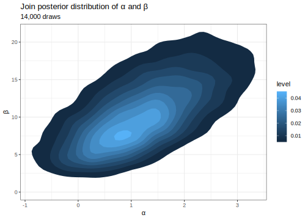
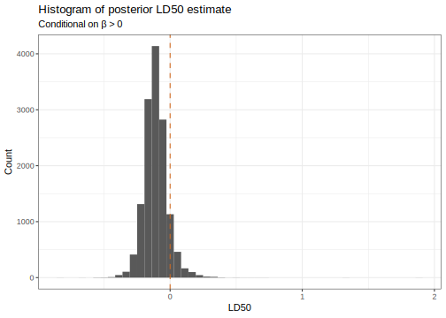

Here's my solution to exercise 11, chapter 3, of
[Gelman's](https://andrewgelman.com/) *Bayesian Data Analysis* (BDA),
3rd edition. There are
[solutions](http://www.stat.columbia.edu/~gelman/book/solutions.pdf) to
some of the exercises on the [book's
webpage](http://www.stat.columbia.edu/~gelman/book/).

<!--more-->
<div style="display:none">

$\DeclareMathOperator{\dbinomial}{Binomial}  \DeclareMathOperator{\dbern}{Bernoulli}  \DeclareMathOperator{\dpois}{Poisson}  \DeclareMathOperator{\dnorm}{Normal}  \DeclareMathOperator{\dt}{t}  \DeclareMathOperator{\dcauchy}{Cauchy}  \DeclareMathOperator{\dexponential}{Exp}  \DeclareMathOperator{\duniform}{Uniform}  \DeclareMathOperator{\dgamma}{Gamma}  \DeclareMathOperator{\dinvgamma}{InvGamma}  \DeclareMathOperator{\invlogit}{InvLogit}  \DeclareMathOperator{\logit}{Logit}  \DeclareMathOperator{\ddirichlet}{Dirichlet}  \DeclareMathOperator{\dbeta}{Beta}$

</div>

We will analyse [the data](data/chapter_03_exercise_11.csv) given in
section 3.7 using different priors.

``` {.r}
df <- read_csv('data/chapter_03_exercise_11.csv') 
```

<table class="table table-striped table-hover table-responsive" style="margin-left: auto; margin-right: auto;">
<thead>
<tr>
<th style="text-align:right;">
dose\_log\_g\_ml
</th>
<th style="text-align:right;">
animals
</th>
<th style="text-align:right;">
deaths
</th>
</tr>
</thead>
<tbody>
<tr>
<td style="text-align:right;">
-0.86
</td>
<td style="text-align:right;">
5
</td>
<td style="text-align:right;">
0
</td>
</tr>
<tr>
<td style="text-align:right;">
-0.30
</td>
<td style="text-align:right;">
5
</td>
<td style="text-align:right;">
1
</td>
</tr>
<tr>
<td style="text-align:right;">
-0.05
</td>
<td style="text-align:right;">
5
</td>
<td style="text-align:right;">
3
</td>
</tr>
<tr>
<td style="text-align:right;">
0.73
</td>
<td style="text-align:right;">
5
</td>
<td style="text-align:right;">
5
</td>
</tr>
</tbody>
</table>
Here is the model specification.

$$
\begin{align}
  y_i \mid \theta_i 
  &\sim 
  \dbinomial(n_i, \theta_i)
  \\
  \logit(\theta_i)
  &=
  \alpha + \beta x_i
  \\
  \alpha
  &\sim
  \dnorm(0, 2^2)
  \\
  \beta
  &\sim
  \dnorm(10, 10^2)
\end{align}
$$

We won't use a grid approximation to the posterior but instead just use
[Stan](https://www.rdocumentation.org/packages/rstanarm/versions/2.17.4/topics/stan_glm)
because it is a lot simpler.

``` {.r}
m <- rstanarm::stan_glm(
  cbind(deaths, animals - deaths)  ~ 1 + dose_log_g_ml,
  family = binomial(link = logit),
  data = df,
  prior_intercept = normal(0, 2),
  prior = normal(10, 10),
  warmup = 500,
  iter = 4000
)

summary(m)
```


    Model Info:

     function:     stan_glm
     family:       binomial [logit]
     formula:      cbind(deaths, animals - deaths) ~ 1 + dose_log_g_ml
     algorithm:    sampling
     priors:       see help('prior_summary')
     sample:       14000 (posterior sample size)
     observations: 4
     predictors:   2

    Estimates:
                    mean   sd   2.5%   25%   50%   75%   97.5%
    (Intercept)    1.3    1.0 -0.5    0.6   1.2   1.9   3.4   
    dose_log_g_ml 11.0    5.0  3.5    7.3  10.3  13.9  22.5   
    mean_PPD       2.3    0.4  1.5    2.0   2.2   2.5   3.2   
    log-posterior -5.6    1.1 -8.4   -6.0  -5.2  -4.8  -4.5   

    Diagnostics:
                  mcse Rhat n_eff
    (Intercept)   0.0  1.0  6103 
    dose_log_g_ml 0.1  1.0  4788 
    mean_PPD      0.0  1.0  9575 
    log-posterior 0.0  1.0  3826 

    For each parameter, mcse is Monte Carlo standard error, n_eff is a crude measure of effective sample size, and Rhat is the potential scale reduction factor on split chains (at convergence Rhat=1).

The [tidybayes
package](https://mjskay.github.io/tidybayes/articles/tidybayes.html)
offers convenient functions for drawing from the posterior. We'll also
add in our `LD50` estimate.

``` {.r}
draws <- m %>% 
  tidybayes::spread_draws(`(Intercept)`, dose_log_g_ml) %>% 
  rename(
    alpha = `(Intercept)`,
    beta = dose_log_g_ml
  ) %>% 
  mutate(LD50 = -alpha / beta)
```



The estimates look much the same with the more informative priors as
with the uninformative priors. The posterior probability that
$\beta > 0$ is:

``` {.r}
draws %>% 
  mutate(positive = beta > 0) %>% 
  summarise(mean(positive)) %>% 
  pull() %>% 
  percent()
```

    [1] "100%"

The posterior LD50 estimate (conditional on $\beta > 0$) is as follows:

``` {.r}
draws %>% 
  filter(beta > 0) %>% 
  ggplot() + 
  aes(LD50) +
  geom_histogram(bins = 50) +
  geom_vline(xintercept = 0, linetype = 'dashed', colour = 'chocolate') +
  labs(
    y = 'Count',
    title = 'Histogram of posterior LD50 estimate',
    subtitle = 'Conditional on β > 0'
  )
```


