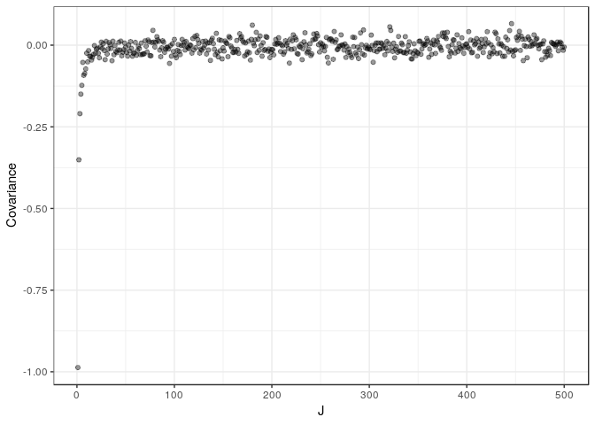

Here's my solution to exercise 4, chapter 5, of
[Gelman's](https://andrewgelman.com/) *Bayesian Data Analysis* (BDA),
3rd edition. There are
[solutions](http://www.stat.columbia.edu/~gelman/book/solutions.pdf) to
some of the exercises on the [book's
webpage](http://www.stat.columbia.edu/~gelman/book/).

<!--more-->
<div style="display:none">

$\DeclareMathOperator{\dbinomial}{Binomial}  \DeclareMathOperator{\dbern}{Bernoulli}  \DeclareMathOperator{\dpois}{Poisson}  \DeclareMathOperator{\dnorm}{Normal}  \DeclareMathOperator{\dt}{t}  \DeclareMathOperator{\dcauchy}{Cauchy}  \DeclareMathOperator{\dexponential}{Exp}  \DeclareMathOperator{\duniform}{Uniform}  \DeclareMathOperator{\dgamma}{Gamma}  \DeclareMathOperator{\dinvgamma}{InvGamma}  \DeclareMathOperator{\invlogit}{InvLogit}  \DeclareMathOperator{\dinvchi}{InvChi2}  \DeclareMathOperator{\dsinvchi}{SInvChi2}  \DeclareMathOperator{\dchi}{Chi2}  \DeclareMathOperator{\dnorminvchi}{NormInvChi2}  \DeclareMathOperator{\logit}{Logit}  \DeclareMathOperator{\ddirichlet}{Dirichlet}  \DeclareMathOperator{\dbeta}{Beta}$

</div>

Suppose we have $2J$ parameters, of which $J$ are $\dnorm(1, 1)$ and the
remaining $J$ are $\dnorm(-1, 1)$. These parameters are exchangeable
since we have no way of knowing which are in the former group in which
in the latter. Their exchangeable joint probability distribution would
be the product of the $2J$ independent normals averaged over all
possible permutations.

Suppose we could write the joint distribution as a mixture of iid
components

$$
p(\theta)
=
\int \prod_{j = 1}^J p(\theta_j \mid \phi) p(\phi) d\phi
.
$$

I won't prove mathematically that his assumption leads to a
contradiction, but rather simulate values to illustrate the point.

First, [the solution to exercise 5](chapter_05_exercise_05.html) shows
that the covariance of $\theta_i, \theta_j$, $i \ne j$, would have to be
non-negative. So let's simulate some values and take a look at the
covariance.

``` {.r}
rbern <- function(n, p) 2 * rbinom(n, 1, p) - 1

simulate <- function(J, iter = 10000) {
  tibble(
      mu1 = rbern(iter, 0.5),
      flip = rbern(iter, (J - 1) / (2*J - 1)),
      mu2 = mu1 * flip,
      theta1 = rnorm(iter, mu1, 1),
      theta2 = rnorm(iter, mu2, 1)
    )
}
```

In our `simulate` function, the `flip` variable indicates whether
$\theta_2$ has a mean that is the negative of the mean of $\theta_1$.
Notice that the probability of a flip depends on $J$. In particular,
when $J = 1$ this probability is 1. For larger values of $J$, the
probability of a flip is strictly greater than 0.5. As $J \to \infty$,
this probability converges to 0.5, as if $\theta_1$ and $\theta_2$ were
independent.


For this case where $J = 1$, the correlation is clearly negative. We can
also see two clusters forming around $(1, -1)$ and $(-1, 1)$. This seems
reasonable since the mean of one is necessarily the negative of the mean
of the other.

To see what happens when $J \to \infty$, let's calculate the covariance
for a range of values of $J$.

``` {.r}
covariance <- function(sims)
  sims %>% 
    summarise(cov(theta1, theta2)) %>% 
    pull()

covariances <- tibble(J = 1:500) %>% 
  mutate(
    sim = map(J, simulate),
    cov_theta1_theta2 = map_dbl(sim, covariance)
  )
```

We can see below that the covariance is quite negative for small values
of $J$, and it seems to converge very quickly to 0. I suspect the
positive values that appear are due to sampling variance.

``` {.r}
covariances %>% 
  ggplot() +
  aes(J, cov_theta1_theta2) +
  geom_point(alpha = 0.4) +
  labs(y = 'Covariance')
```



Finally, let's plot the samples for a large value of $J$ to verify that
there is (almost) no covariance.


The covariance is negative for finite $J$ since a large value of
$\theta_1$ implies it is most likely from $\dnorm(1, 1)$, which implies
that $\theta_2$ is most likely from $\dnorm(-1, 1)$ and would have a
smaller value (and vice versa). This contradicts the assumption that we
can write the joint distribution as a mixture of iids.

This doesn't lead to a contradiction to de Finetti's theorem by letting
$J \to \infty$ because the covariances converge to 0.
