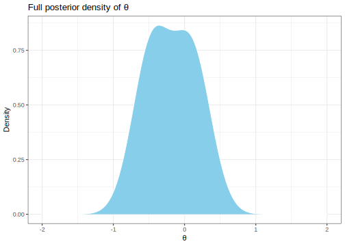

Here's my solution to exercise 8, chapter 5, of
[Gelman's](https://andrewgelman.com/) *Bayesian Data Analysis* (BDA),
3rd edition. There are
[solutions](http://www.stat.columbia.edu/~gelman/book/solutions.pdf) to
some of the exercises on the [book's
webpage](http://www.stat.columbia.edu/~gelman/book/).

<!--more-->
<div style="display:none">

$\DeclareMathOperator{\dbinomial}{Binomial}  \DeclareMathOperator{\dbern}{Bernoulli}  \DeclareMathOperator{\dpois}{Poisson}  \DeclareMathOperator{\dnorm}{Normal}  \DeclareMathOperator{\dt}{t}  \DeclareMathOperator{\dcauchy}{Cauchy}  \DeclareMathOperator{\dexponential}{Exp}  \DeclareMathOperator{\duniform}{Uniform}  \DeclareMathOperator{\dgamma}{Gamma}  \DeclareMathOperator{\dinvgamma}{InvGamma}  \DeclareMathOperator{\invlogit}{InvLogit}  \DeclareMathOperator{\logit}{Logit}  \DeclareMathOperator{\ddirichlet}{Dirichlet}  \DeclareMathOperator{\dbeta}{Beta}$

</div>

Let $p_m(\theta)$, $m = 1, \dotsc, M$, be conjugate prior densities for
the likelihood $y \mid \theta$, and $\lambda_m \in [0, 1]$ such that
$\sum_1^M \lambda_m = 1$. We show that
$p(\theta) := \sum_{m = 1}^M \lambda_m p_m(\theta)$ is also a conjugate
prior. This follows from the calculation of the posterior:

$$
\begin{align}
  p (\theta \mid y)
  &\propto
  p (y \mid \theta) p(\theta)
  \\
  &=
  p (y \mid \theta) \sum_1^M \lambda_m p_m(\theta)
  \\
  &=
  \sum_1^M \lambda_m p(y \mid \theta) p_m(\theta) 
  \\
  &=
  \sum_1^M \lambda_m p_m(y) p_m (\theta \mid y)
  \\
  &=
  \sum_1^M \lambda_m' p_m (\theta \mid y)
  ,
\end{align}
$$

where $\lambda_m' := \lambda_m p_m (y)$. Since each term
$p_m(\theta \mid y)$ has the same parametric form as $p_m(\theta)$, the
posterior has the same parametric form as the prior,
$\sum_1^M \lambda_m p_m(\theta)$.

To apply this to a concrete example, suppose
$y \mid \theta \sim \dnorm(\theta, 1)$, where $\theta$ is mostl likely
near $1$ with standard deviation of 0.5 but has some probability of
being near -1, still with standard deviation 0.5. Let's calculate the
posterior after 10 observations with mean -0.25.

``` {.r}
mu_pos <- 1
sd_pos <- 0.5
lambda_pos <- 0.9

mu_neg <- -1
sd_neg <- 0.5
lambda_neg <- 1 - lambda_pos

prior <- tibble(
  theta = seq(-3, 3, 0.01),
  density_pos = dnorm(theta, mu_pos, sd_pos),
  density_neg = dnorm(theta, mu_neg, sd_neg),
  density = lambda_pos * density_pos + lambda_neg * density_neg
)
```


The posterior for each mixture component can be calculated using
equation 2.12 (page 42). In particular,

$$
\begin{align}
  p^\pm (\theta \mid \bar y) &= \dnorm( \theta \mid \mu_{10}^\pm, \sigma_{10}^\pm)
  ,
\end{align}
$$

where

``` {.r}
n <- 10
ybar <- -0.25

sigma <- 1

sd_10_pos <- 1 / sqrt(1 / sd_pos^2 + n / sigma^2)
mu_10_pos <- (mu_pos / sd_pos^2 + n * ybar / sigma^2) / (1 / sd_10_pos^2)

sd_10_neg <- 1 / sqrt(1 / sd_neg^2 + n / sigma^2)
mu_10_neg <- (mu_neg / sd_neg^2 + n * ybar / sigma^2) / (1 / sd_10_neg^2)
```

This gives us positive and negative means of 0.107, -0.464,
respectively, and stanard deviations both equal to 0.267.

In order to find the full posterior distribution, we also need the
posterior mixture proportions. These are given by

``` {.r}
py_pos <- dnorm(ybar, mu_pos, sqrt(sd_pos^2 + sigma^2 / n))
lambda_prime_pos0 <- lambda_pos * py_pos

py_neg <- dnorm(ybar, mu_neg, sqrt(sd_neg^2 + sigma^2 / n))
lambda_prime_neg0 <- lambda_neg * py_neg

normaliser <- lambda_prime_pos0 + lambda_prime_neg0
lambda_prime_pos <- lambda_prime_pos0 / normaliser
lambda_prime_neg <- lambda_prime_neg0 / normaliser
```

This gives positive and negative weights of 68.3%, 31.7%, respectively.

We'll calculate the normalised posterior density on a grid between \[-3,
3\].

``` {.r}
granularity <- 0.01

posterior <- tibble(
  theta = seq(-3, 3, granularity),
  density_pos = dnorm(theta, mu_10_pos, sd_10_pos),
  density_neg = dnorm(theta, mu_10_neg, sd_10_neg),
  density_unnormalised = lambda_prime_pos * density_pos + lambda_prime_neg * density_neg,
  density = density_unnormalised / sum(density_unnormalised * granularity)
) 
```



This posterior looks like a 'hunchback normal' distribution, with the
two modes being much less distinct.
