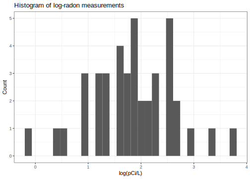
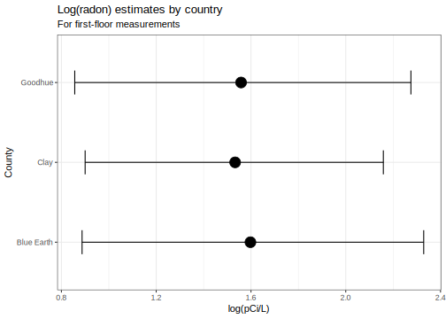
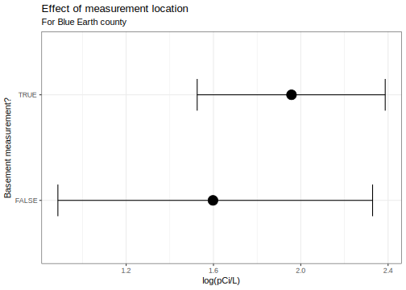
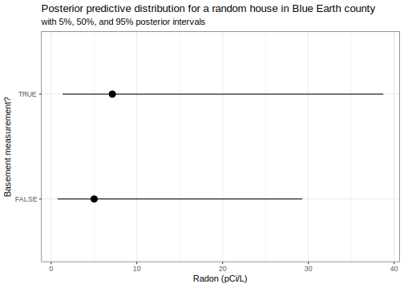

Here's my solution to exercise 1, chapter 14, of
[Gelman's](https://andrewgelman.com/) *Bayesian Data Analysis* (BDA),
3rd edition. There are
[solutions](http://www.stat.columbia.edu/~gelman/book/solutions.pdf) to
some of the exercises on the [book's
webpage](http://www.stat.columbia.edu/~gelman/book/).

<!--more-->
<div style="display:none">

$\DeclareMathOperator{\dbinomial}{Binomial}  \DeclareMathOperator{\dbern}{Bernoulli}  \DeclareMathOperator{\dpois}{Poisson}  \DeclareMathOperator{\dnorm}{Normal}  \DeclareMathOperator{\dt}{t}  \DeclareMathOperator{\dcauchy}{Cauchy}  \DeclareMathOperator{\dexponential}{Exp}  \DeclareMathOperator{\duniform}{Uniform}  \DeclareMathOperator{\dgamma}{Gamma}  \DeclareMathOperator{\dinvgamma}{InvGamma}  \DeclareMathOperator{\invlogit}{InvLogit}  \DeclareMathOperator{\logit}{Logit}  \DeclareMathOperator{\ddirichlet}{Dirichlet}  \DeclareMathOperator{\dbeta}{Beta}$

</div>

We are given the following data and asked to fit a linear regression to
the log-radon measurements.

``` {.r}
df <- read_csv('data/chapter_07_exercise_06_radon.csv')
```

<table class="table table-striped table-hover table-responsive" style="margin-left: auto; margin-right: auto;">
<caption>
Table 7.3 from page 195 (sample)
</caption>
<thead>
<tr>
<th style="text-align:left;">
county
</th>
<th style="text-align:right;">
radon\_pCiL
</th>
<th style="text-align:left;">
basement
</th>
</tr>
</thead>
<tbody>
<tr>
<td style="text-align:left;">
Blue Earth
</td>
<td style="text-align:right;">
5.0
</td>
<td style="text-align:left;">
TRUE
</td>
</tr>
<tr>
<td style="text-align:left;">
Blue Earth
</td>
<td style="text-align:right;">
13.0
</td>
<td style="text-align:left;">
TRUE
</td>
</tr>
<tr>
<td style="text-align:left;">
Blue Earth
</td>
<td style="text-align:right;">
7.2
</td>
<td style="text-align:left;">
TRUE
</td>
</tr>
<tr>
<td style="text-align:left;">
Blue Earth
</td>
<td style="text-align:right;">
6.8
</td>
<td style="text-align:left;">
TRUE
</td>
</tr>
<tr>
<td style="text-align:left;">
Blue Earth
</td>
<td style="text-align:right;">
12.8
</td>
<td style="text-align:left;">
TRUE
</td>
</tr>
</tbody>
</table>
On the log scale, the measurements vary mostly between 0 and 4.



I'll take this opportunity to play around with
[`brms`](https://rdrr.io/cran/brms/), a powerful package for working
with [stan](https://mc-stan.org/) models. It took me a while to get
familiar with the notation for specifying priors. The `get_prior`
function is useful to check what you can put priors on, whilst also
displaying the defaults.

``` {.r}
p <- get_prior(
  log(radon_pCiL) ~ 0 + county + basement,
  df
)
```

<table class="table table-striped table-hover table-responsive" style="margin-left: auto; margin-right: auto;">
<caption>
Output from the `get_prior` function. Some columns are not shown.
</caption>
<thead>
<tr>
<th style="text-align:left;">
prior
</th>
<th style="text-align:left;">
class
</th>
<th style="text-align:left;">
coef
</th>
</tr>
</thead>
<tbody>
<tr>
<td style="text-align:left;">
</td>
<td style="text-align:left;">
b
</td>
<td style="text-align:left;">
</td>
</tr>
<tr>
<td style="text-align:left;">
</td>
<td style="text-align:left;">
b
</td>
<td style="text-align:left;">
basementTRUE
</td>
</tr>
<tr>
<td style="text-align:left;">
</td>
<td style="text-align:left;">
b
</td>
<td style="text-align:left;">
countyBlueEarth
</td>
</tr>
<tr>
<td style="text-align:left;">
</td>
<td style="text-align:left;">
b
</td>
<td style="text-align:left;">
countyClay
</td>
</tr>
<tr>
<td style="text-align:left;">
</td>
<td style="text-align:left;">
b
</td>
<td style="text-align:left;">
countyGoodhue
</td>
</tr>
<tr>
<td style="text-align:left;">
student\_t(3, 0, 10)
</td>
<td style="text-align:left;">
sigma
</td>
<td style="text-align:left;">
</td>
</tr>
</tbody>
</table>
For our example, there are two classes: `b` and `sigma`. The former is
for the regression coefficients and the latter for the measurement
error. The default prior on the coefficients is a uniform prior (stan's
default) since the entries under the `prior` column are all empty. The
`sigma` parameter gets a t-distribution by default (with 3 degrees of
freedom).

We can put the same prior on each of the parameters of class `b` by only
specifying the class in the `prior` function:

``` {.r}
my_prior <- c(
  prior(normal(0, 10), class = 'b'),
  prior(scaled_inv_chi_square(1, 1), class = 'sigma')
)
```

<table class="table table-striped table-hover table-responsive" style="margin-left: auto; margin-right: auto;">
<caption>
Details of my prior. Some columns are not shown.
</caption>
<thead>
<tr>
<th style="text-align:left;">
prior
</th>
<th style="text-align:left;">
class
</th>
<th style="text-align:left;">
coef
</th>
</tr>
</thead>
<tbody>
<tr>
<td style="text-align:left;">
normal(0, 10)
</td>
<td style="text-align:left;">
b
</td>
<td style="text-align:left;">
</td>
</tr>
<tr>
<td style="text-align:left;">
scaled\_inv\_chi\_square(1, 1)
</td>
<td style="text-align:left;">
sigma
</td>
<td style="text-align:left;">
</td>
</tr>
</tbody>
</table>
We have given all coefficients a $\dnorm(0, 10)$ prior, and the `sigma`
prior a scaled inverse chi squared prior. By adding in the `coef`
argument into the `prior` function, we could specify priors for each of
the different coefficients individually. For example, the following is
equivalent to `my_prior`.

``` {.r}
my_prior_alt <- c(
  prior(normal(0, 10), class = 'b', coef = 'basementTRUE'),
  prior(normal(0, 10), class = 'b', coef = 'countyBlueEarth'),
  prior(normal(0, 10), class = 'b', coef = 'countyGoodhue'),
  prior(normal(0, 10), class = 'b', coef = 'countyClay'),
  prior(scaled_inv_chi_square(1, 1), class = 'sigma')
)
```

<table class="table table-striped table-hover table-responsive" style="margin-left: auto; margin-right: auto;">
<caption>
Equivalent specification of my prior. Some columns are not shown.
</caption>
<thead>
<tr>
<th style="text-align:left;">
prior
</th>
<th style="text-align:left;">
class
</th>
<th style="text-align:left;">
coef
</th>
</tr>
</thead>
<tbody>
<tr>
<td style="text-align:left;">
normal(0, 10)
</td>
<td style="text-align:left;">
b
</td>
<td style="text-align:left;">
basementTRUE
</td>
</tr>
<tr>
<td style="text-align:left;">
normal(0, 10)
</td>
<td style="text-align:left;">
b
</td>
<td style="text-align:left;">
countyBlueEarth
</td>
</tr>
<tr>
<td style="text-align:left;">
normal(0, 10)
</td>
<td style="text-align:left;">
b
</td>
<td style="text-align:left;">
countyGoodhue
</td>
</tr>
<tr>
<td style="text-align:left;">
normal(0, 10)
</td>
<td style="text-align:left;">
b
</td>
<td style="text-align:left;">
countyClay
</td>
</tr>
<tr>
<td style="text-align:left;">
scaled\_inv\_chi\_square(1, 1)
</td>
<td style="text-align:left;">
sigma
</td>
<td style="text-align:left;">
</td>
</tr>
</tbody>
</table>
Apparently, specifying just a class prior (instead of each coefficient
individually) allows brms to better take advantage of vectorisation.
Since vectorisation often results in faster sampling, we'll stick with
the first specification.

Fitting the model works as you'd expect. We'll supress the stan output.

``` {.r}
set.seed(32060)

fit <- brms::brm(
  log(radon_pCiL) ~ 0 + county + basement,
  data = df,
  prior = my_prior
)
```

The summary displays some general information about the model, together
with parameter estimates and some sampling diagnostics (rhat and
effective sample size).

``` {.r}
summary(fit, priors = TRUE)
```

     Family: gaussian 
      Links: mu = identity; sigma = identity 
    Formula: log(radon_pCiL) ~ 0 + county + basement 
       Data: df (Number of observations: 41) 
    Samples: 4 chains, each with iter = 2000; warmup = 1000; thin = 1;
             total post-warmup samples = 4000

    Priors: 
    b ~ normal(0, 10)
    sigma ~ scaled_inv_chi_square(1, 1)

    Population-Level Effects: 
                    Estimate Est.Error l-95% CI u-95% CI Eff.Sample Rhat
    countyBlueEarth     1.60      0.36     0.89     2.33       1485 1.00
    countyClay          1.53      0.32     0.90     2.16       1580 1.00
    countyGoodhue       1.56      0.36     0.86     2.28       1421 1.00
    basementTRUE        0.35      0.33    -0.31     1.00       1266 1.00

    Family Specific Parameters: 
          Estimate Est.Error l-95% CI u-95% CI Eff.Sample Rhat
    sigma     0.81      0.10     0.65     1.04       1945 1.00

    Samples were drawn using sampling(NUTS). For each parameter, Eff.Sample 
    is a crude measure of effective sample size, and Rhat is the potential 
    scale reduction factor on split chains (at convergence, Rhat = 1).

The estimates for log-radon levels in each county are approximately the
same. Basement measurements have higher radon levels but it's not clear
from this dataset that this effect is not just noise. The prediction
error (`sigma`) is fairly large in relation to the coefficient
estimates.

We can also get plots of the marginal effects from brms.

``` {.r}
ps <- fit %>% 
  brms::marginal_effects() %>% 
  plot(ask=FALSE, plot=FALSE)
```



The [tidybayes](https://mjskay.github.io/tidybayes/) package is useful
for posterior predictive distributions via
[`add_predicted_draws`](https://rdrr.io/cran/tidybayes/man/add_predicted_draws.html).
Note that it is important to transform the radon estimates to the
observation scale before calculating the posterior intervals.

``` {.r}
pp <- crossing(
    county = 'Blue Earth',
    basement = c(FALSE, TRUE)
  ) %>% 
  tidybayes::add_predicted_draws(fit) %>% 
  mutate(radon = exp(.prediction)) %>% 
  tidybayes::median_qi() 
```


