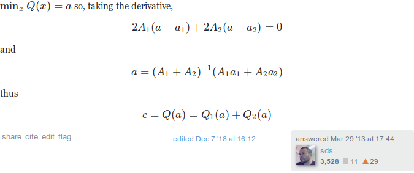

When solving [chapter 3 exercise 9](./chapter_03_exercise_09.html) of BDA3, I felt like most of the algebra was unecessary. It turns out that it was indeed unnecessary, but I only realised how to simplify it after reading [this StackExchange answer](https://math.stackexchange.com/a/345846/31873). The idea is that the sum of quadratic forms, $Q_1$ and $Q_2$, is again a quadratic form, $Q$. Since the exponents of the exponentials in both the prior and likelihood are quadratic forms, we can simply read of most of the equalities from the expression for the resulting quadratic form.

<!--more-->

## Theorem

Suppose we have two quadratic forms

$$
\begin{align}
  Q_1(\mu) 
  &=
  A_1 (\mu - a_1)^2
  \\
  Q_2(\mu) 
  &=
  A_2 (\mu - a_2)^2
.
\end{align}
$$

Then $Q(\mu) := Q_1(\mu) + Q_2(\mu)$ is also a quadratic form, given by

$$
\begin{align}
  Q(\mu) 
  &= 
  (A_1 + A_2) (\mu - a) + c
  \\
  a
  &= 
  \frac{A_1a_1 + A_2a_2}{A_1  A_2}
  \\
  c
  &=
  Q_1(a) + Q_2(a)
  .
\end{align}
$$

The proof is fairly straightforward, so I'll just post a screenshot of the StackExchange answer:

Go give the guy an upvote.

## BDA3 chapter 3 exercise 9

To see how the above theorem can help, let's redo [chapter 3 exercise 9](./chapter_03_exercise_09.html) of BDA3. We have the two quadratic forms

$$
\begin{align}
  Q_1(\mu) 
  &=
  \kappa_0 (\mu - \mu_0)^2
  \\
  Q_2(\mu) 
  &=
  n (\mu - \bar y)^2
\end{align}
$$

from the prior and likelihood, respectively. Their sum is also a quadratic form $Q := Q_1 + Q_2$, which we can write as

$$
  Q(\mu)
  =
  A(\mu - a) + c
$$

using the same notation as on StackExchange. Thus,

$$
\begin{align}
  A &= n + \kappa_0
  \\
  a &= \frac{1}{n + \kappa_0} (\kappa_0\mu_0 + n \bar y)
  \\
  c &= Q_1(a) + Q_2(a)
\end{align}
$$

which already shows that

$$
\begin{align}
  \mu_n &= \frac{\kappa_0}{\kappa_0 + n}\mu_0 + \frac{n}{\kappa_0 + n} \bar y
  \\
  \kappa_n &= \kappa_0 + n
  .
\end{align}
$$

The identity  $\nu_n = \nu_0 + n$ is a simple calculation on the exponents of the $\sigma$ factor. All that remains is to calculate $c$. Plugging in the numbers we get

$$
\begin{align}
  c
  &=
  \kappa_0 \left(\frac{\kappa_0\mu_0 + n\bar y}{n + \kappa_0} - \mu_0 \right)^2
  +
  n \left(\frac{\kappa_0\mu_0 + n\bar y}{n + \kappa_0} - \bar y \right)
  \\
  &=
  \kappa_0 \left(\frac{n\bar y - n\mu_0}{n + \kappa_0} \right)^2
  +
  n \left(\frac{\kappa_0\mu_0 -\kappa_0 \bar y}{n + \kappa_0} \right)
  \\
  &=
  \kappa_0 n^2 \left(\frac{\bar y - \mu_0}{n + \kappa_0} \right)^2
  +
  \kappa_0^2 n \left(\frac{\mu_0 - \bar y}{n + \kappa_0} \right)^2
  \\
  &=
  \kappa_0 n \left( \frac{\mu_0 - \bar y}{n + \kappa_0} \right)^2 \cdot (n + \kappa_0)
  \\
  &=
  \kappa_0 n \frac{(\mu_0 - \bar y)^2}{n + \kappa_0}
  .
\end{align}
$$

Adding $c$ to the remaining terms in the exponent of the exponential, gives us that   
  $\nu_n \sigma_n^2 = \nu_0 \sigma_0^2 + (n - 1) s^2 + \frac{\kappa_0 n}{\kappa_0 + n}(\bar y - \mu_0)^2$.
  
  
In summary, this simple theorem described above is enough to turn a page of nasty algebra into a few simple lines.