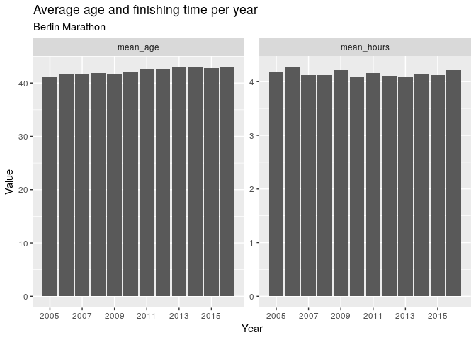
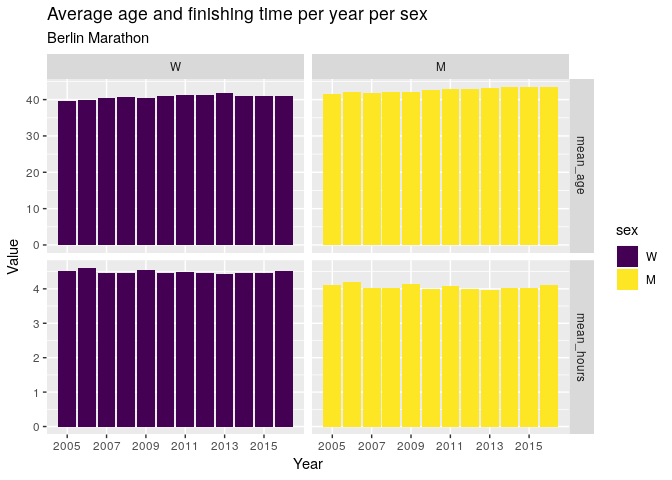
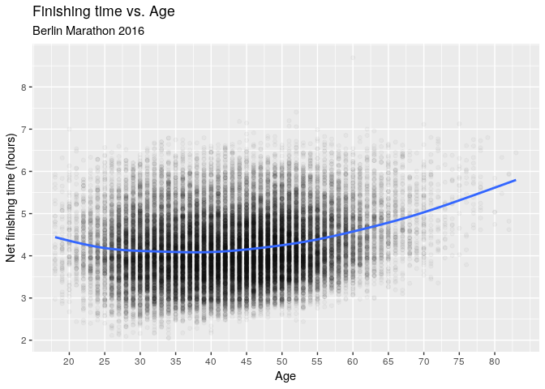
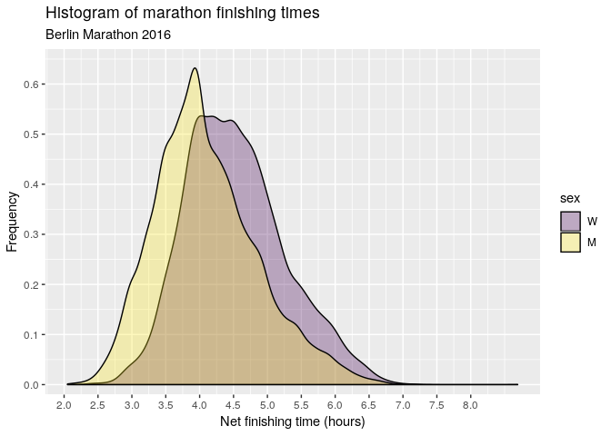
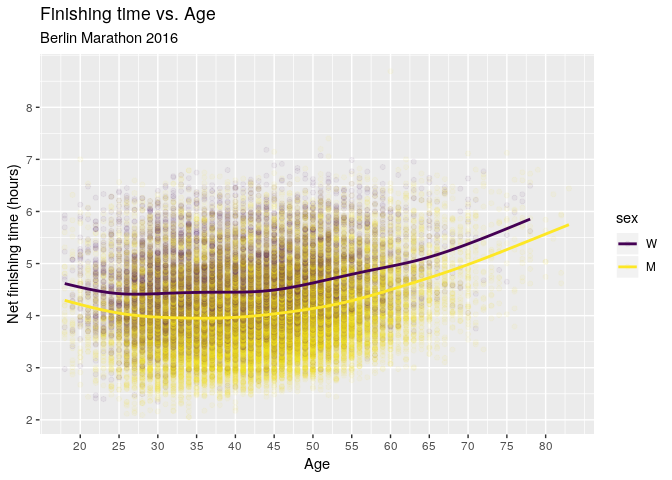
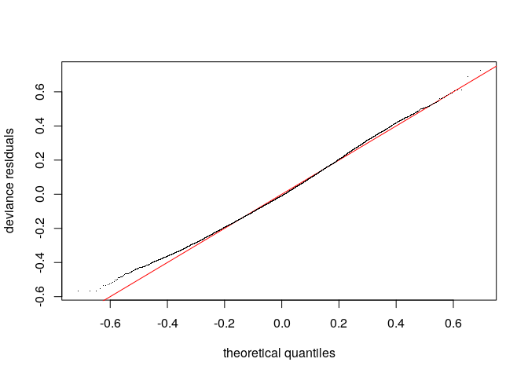
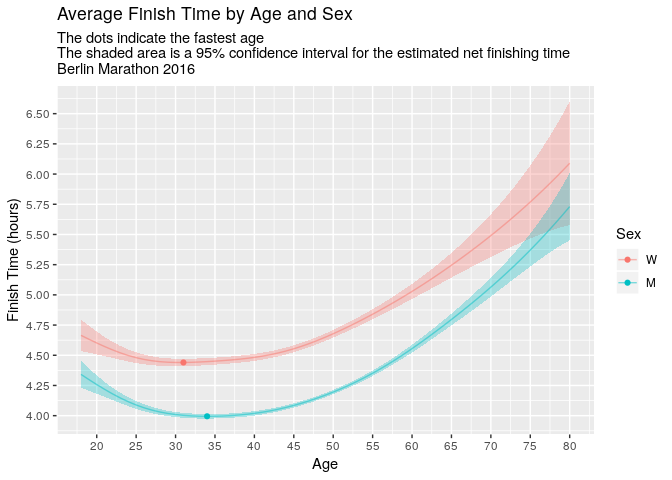
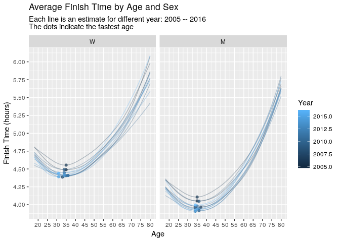
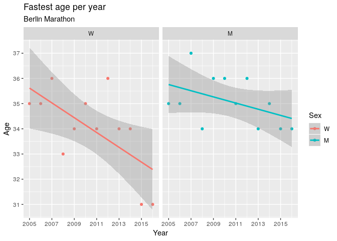
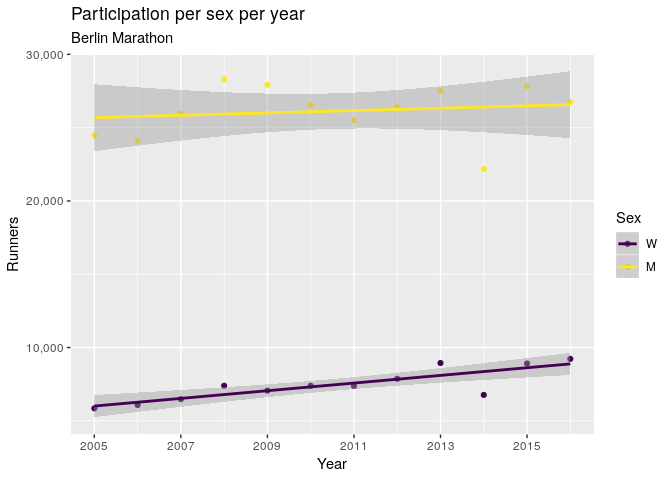

Running is great. One of the worst parts, though, is other people
telling you how it's all downhill after 30. But is it? It's a persistent
idea, so I wanted to see if actual marathon results support it. To get
an idea of how age affects running performance, we'll use the data from
the [Berlin
Marathon](https://www.bmw-berlin-marathon.com/en/race-day-/results-list.html),
after some [cleaning up](https://github.com/stappit/berlin-marathon),
focussing on the year 2016.

<!--more-->


**tl;dr** The performance of the average 20 year old is comparable to
that of the average 50 year old. The 34 year old men were the fastest on
average for their sex, whereas the 31 year old women were fastest on
average for their sex.

Let's load the data.

``` {.r}
# mapping table from country abbreviations to country names
mapping <- read_csv('data/country_continent_mapping.csv') %>%
  transmute(
    country = name,
    alpha3 = `alpha-3`
  )

# read all the data: 2005 to 2016
df0 <- read_csv('data/berlin_marathon_times.csv') %>%
  transmute(
    year,
    age,
    sex = ordered(sex, levels = c('W', 'M')),
    usex = factor(sex, levels = c('W', 'M'), ordered = FALSE), # for technical reasons
    alpha3 = nationality, # for joining with mapping table
    net_time = as.duration(hms(net_time)),
    hours = as.numeric(net_time, 'hours')
  ) %>%
  inner_join(mapping, by = 'alpha3') %>%
  mutate(country = factor(country)) %>%
  arrange(hours) %>%
  drop_na() 

# year of interest
df <- df0 %>% 
  filter(year == 2016)

# sample of data
df %>% 
  head() %>% 
  select(-usex, -alpha3, -hours) %>% 
  kable() %>% 
  kable_styling(bootstrap_options = c("striped", "hover", "responsive"))
```

<table class="table table-striped table-hover table-responsive" style="margin-left: auto; margin-right: auto;">
<thead>
<tr>
<th style="text-align:right;">
year
</th>
<th style="text-align:right;">
age
</th>
<th style="text-align:left;">
sex
</th>
<th style="text-align:right;">
net\_time
</th>
<th style="text-align:left;">
country
</th>
</tr>
</thead>
<tbody>
<tr>
<td style="text-align:right;">
2016
</td>
<td style="text-align:right;">
34
</td>
<td style="text-align:left;">
M
</td>
<td style="text-align:right;">
7383s (\~2.05 hours)
</td>
<td style="text-align:left;">
Ethiopia
</td>
</tr>
<tr>
<td style="text-align:right;">
2016
</td>
<td style="text-align:right;">
34
</td>
<td style="text-align:left;">
M
</td>
<td style="text-align:right;">
7393s (\~2.05 hours)
</td>
<td style="text-align:left;">
Kenya
</td>
</tr>
<tr>
<td style="text-align:right;">
2016
</td>
<td style="text-align:right;">
28
</td>
<td style="text-align:left;">
M
</td>
<td style="text-align:right;">
7531s (\~2.09 hours)
</td>
<td style="text-align:left;">
Kenya
</td>
</tr>
<tr>
<td style="text-align:right;">
2016
</td>
<td style="text-align:right;">
26
</td>
<td style="text-align:left;">
M
</td>
<td style="text-align:right;">
7616s (\~2.12 hours)
</td>
<td style="text-align:left;">
Ethiopia
</td>
</tr>
<tr>
<td style="text-align:right;">
2016
</td>
<td style="text-align:right;">
27
</td>
<td style="text-align:left;">
M
</td>
<td style="text-align:right;">
7667s (\~2.13 hours)
</td>
<td style="text-align:left;">
Kenya
</td>
</tr>
<tr>
<td style="text-align:right;">
2016
</td>
<td style="text-align:right;">
34
</td>
<td style="text-align:left;">
M
</td>
<td style="text-align:right;">
7769s (\~2.16 hours)
</td>
<td style="text-align:left;">
Kenya
</td>
</tr>
</tbody>
</table>
We have the variables `age`, `sex`, `nationality`, and `net_time` for a
cross section of marathon runners to play with. To measure the effect of
age on running performance, we should really be looking at multiple
measurements of the same runners at different ages, whilst controlling
for features more directly related to running performance (e.g. vO2max,
training volume). This would be a fairly expensive experiment and I
didn't find any research in that direction (if you find some, please let
me know). We'll do what we can with the data at hand but the results can
only be suggestive of interesting questions to pursue.

A first look
------------

The average finishing time amongst the runners is about 4 hours 12
minutes, and the average age around 42. These numbers are fairly
constant over the years.

``` {.r}
df0 %>% 
  group_by(year) %>% 
  summarise(
    mean_hours = mean(hours),
    mean_age = mean(age)
  ) %>% 
  gather(metric, value, mean_hours, mean_age) %>% 
  ggplot(aes(x = year, y = value)) +
  geom_col() +
  scale_x_discrete(limits = seq(2005, 2016, 2)) +
  facet_wrap(~ metric, scales = 'free_y') +
  labs(
    x = 'Year',
    y = 'Value',
    title = 'Average age and finishing time per year',
    subtitle = 'Berlin Marathon'
  ) +
  NULL
```



The results are similar when broken down by sex.

``` {.r}
df0 %>% 
  group_by(year, sex) %>% 
  summarise(
    mean_hours = mean(hours),
    mean_age = mean(age)
  ) %>% 
  gather(metric, value, mean_hours, mean_age) %>% 
  ggplot(aes(x = year, y = value, fill = sex)) +
  geom_col() +
  scale_x_discrete(limits = seq(2005, 2016, 2)) +
  facet_grid(metric ~ sex, scales = 'free_y') +
  labs(
    x = 'Year',
    y = 'Value',
    title = 'Average age and finishing time per year per sex',
    subtitle = 'Berlin Marathon'
  ) +
  NULL
```



### Age and Sex

Below is a scatter plot of finishing time against age. The first
noticable property is that there is a LOT of variation. Indeed, it would
be highly suprising if we could explain running performance with just
age, with factors such as
[vvO2max](https://en.wikipedia.org/wiki/VVO2max) and [lactate
threshold](https://en.wikipedia.org/wiki/Lactate_threshold) being much
more relevant. For some scale of reference, a sub-3h marathon is a
challenging goal for many amateur marathon runners - a goal achieved by
some in their 60s in this dataset.

``` {.r}
df %>%
  ggplot(aes(x = age, y = hours)) + 
  geom_point(alpha = 0.03) +
  geom_smooth(se = FALSE) +
  scale_y_continuous(breaks = seq(2, 8, by = 1)) +
  scale_x_continuous(breaks = seq(20, 80, by = 5)) +
  labs(
    y = 'Net finishing time (hours)',
    x = 'Age',
    title = 'Finishing time vs. Age', 
    subtitle = 'Berlin Marathon 2016'
  ) 
```



Next up is the trend line, which shows that the runners in their early
20s were actually a bit slower than those in their late 20s. The trend
then stays fairly flat until the early 40s, when the trend starts to
slow down.

The above chart lumps men and women together, but the following
histogram suggests a difference between the sexes.

``` {.r}
df %>%
  ggplot(aes(hours, fill = sex)) + 
  geom_density(alpha = 0.3) +
  scale_x_continuous(breaks = seq(2, 8, by = 0.5)) +
  scale_y_continuous(limits = c(0, 0.65), breaks = seq(0, 0.6, by = 0.1), expand = c(0, 0.02)) +
  labs(
    x = 'Net finishing time (hours)',
    y = 'Frequency',
    title = 'Histogram of marathon finishing times', 
    subtitle = 'Berlin Marathon 2016'
  )
```



Breaking down the hours-age chart by `sex` tells a similar story. The
main difference is that the trend for women flattens out a bit earlier
at around age 25 compared to around age 30 for men.

``` {.r}
df %>%
  ggplot(aes(x = age, y = hours, colour = sex)) + 
  geom_point(alpha = 0.05) +
  geom_smooth(se = FALSE) +
  scale_y_continuous(breaks = seq(2, 8, by = 1)) +
  scale_x_continuous(breaks = seq(20, 80, by = 5)) +
  labs(
    y = 'Net finishing time (hours)',
    x = 'Age',
    title = 'Finishing time vs. Age', 
    subtitle = 'Berlin Marathon 2016'
  ) 
```



### Nationality

It is also possible that nationality plays some role here. The Berlin
marathon is an international event with big prize money at stake and it
draws the best of the best from around the world. International travel
is also costly and it seems plausible that this could have some
influence on the statistical properties of the runners.

``` {.r}
ranking_m1 <- df %>% 
  group_by(country) %>%
  summarise(
    mean_hours = mean(hours), 
    mean_age = mean(age), 
    runners = n()
  ) %>%
  arrange(mean_hours) 

head(ranking_m1) %>% 
  kable() %>% 
  kable_styling(bootstrap_options = c("striped", "hover", "responsive"))
```

<table class="table table-striped table-hover table-responsive" style="margin-left: auto; margin-right: auto;">
<thead>
<tr>
<th style="text-align:left;">
country
</th>
<th style="text-align:right;">
mean\_hours
</th>
<th style="text-align:right;">
mean\_age
</th>
<th style="text-align:right;">
runners
</th>
</tr>
</thead>
<tbody>
<tr>
<td style="text-align:left;">
Lesotho
</td>
<td style="text-align:right;">
2.451111
</td>
<td style="text-align:right;">
36.00000
</td>
<td style="text-align:right;">
1
</td>
</tr>
<tr>
<td style="text-align:left;">
Eritrea
</td>
<td style="text-align:right;">
2.657500
</td>
<td style="text-align:right;">
28.25000
</td>
<td style="text-align:right;">
4
</td>
</tr>
<tr>
<td style="text-align:left;">
Ethiopia
</td>
<td style="text-align:right;">
2.749514
</td>
<td style="text-align:right;">
28.33333
</td>
<td style="text-align:right;">
12
</td>
</tr>
<tr>
<td style="text-align:left;">
Kenya
</td>
<td style="text-align:right;">
2.963480
</td>
<td style="text-align:right;">
34.94737
</td>
<td style="text-align:right;">
19
</td>
</tr>
<tr>
<td style="text-align:left;">
Kazakhstan
</td>
<td style="text-align:right;">
3.002222
</td>
<td style="text-align:right;">
27.00000
</td>
<td style="text-align:right;">
1
</td>
</tr>
<tr>
<td style="text-align:left;">
Guinea
</td>
<td style="text-align:right;">
3.130556
</td>
<td style="text-align:right;">
26.00000
</td>
<td style="text-align:right;">
1
</td>
</tr>
</tbody>
</table>
However, a breakdown of the 118 countries has the problem that the
number of participants for many countries is very small. Small sample
sizes lead to high-variance estimates. In other words, we don't
necessarily believe that the average Berlin marathon runner from Lesotho
is faster than the average Berlin marathon runner from Kenya on the
basis of just one runner. We need some way of using all the information
available so that low sample size groups don't have such extreme
estimates. In the next section, we will use random effects to account
for this.

Models
------

This section gets a bit technical; feel free to skip to the end for the
pretty charts.

The trend for age doesn't look linear - it has a U-shape. We could try
to model this by adding the quadratic term `age^2` into our linear
models. However, in general we don't know how many powers we will need
to sufficiently model the effect and the effect may not even be
polynomial. Instead, we harness the power of general additive models,
a.k.a GAMs. Indeed, the trend lines in our plots above actually used
GAMs behind the scenes. The advantage of using GAMs is that you don't
have to mess around trying to add the right number of powers into your
linear models, or even assume the the trend is polynomial at all.

The `s()` notation indicates that we want to fit an arbitrary smooth
function to the data (not just a linear function). A **smooth** has a
number of optional parameters; here `bs = re` uses random effects as our
basis, and `by = sex` indicates a different age-smooth for each sex.

``` {.r}
m <- gam(
  hours ~ 1 + s(country, bs = 're') + usex + s(age) + s(age, by = sex), 
  family = Gamma(),
  data = df, 
  method = "REML"
)

summary(m)
```


    Family: Gamma 
    Link function: inverse 

    Formula:
    hours ~ 1 + s(country, bs = "re") + usex + s(age) + s(age, by = sex)

    Parametric coefficients:
                Estimate Std. Error t value Pr(>|t|)    
    (Intercept) 0.221962   0.002341   94.81   <2e-16 ***
    usexM       0.024254   0.000469   51.72   <2e-16 ***
    ---
    Signif. codes:  0 '***' 0.001 '**' 0.01 '*' 0.05 '.' 0.1 ' ' 1

    Approximate significance of smooth terms:
                   edf  Ref.df      F p-value    
    s(country)  83.294 117.000 23.306 < 2e-16 ***
    s(age)       6.004   6.959 64.706 < 2e-16 ***
    s(age):sexM  3.931   4.817  4.439 0.00105 ** 
    ---
    Signif. codes:  0 '***' 0.001 '**' 0.01 '*' 0.05 '.' 0.1 ' ' 1

    R-sq.(adj) =  0.179   Deviance explained = 17.9%
    -REML =  37846  Scale est. = 0.028131  n = 35986

This model achieves an explained deviance of 17.9% (analogous to R\^2
for Gaußian models). This is low, as expected, but it is unlikely we can
get anything much higher from this dataset.

The observations in the dataset are to some degree not independent since
many runners run in packs. This is especially the case for those runners
following the official pacers. It is not clear how we could account for
this or to what extent it affects the estimates. My guess is that it
wouldn't change them too much.

The residual QQ plot seems acceptable.

``` {.r}
qq.gam(m)
```



The country-level effects are modelled as Gaußian and the QQ plot
indicates a decent fit, with the execption of a handful of countries on
the extremes. Perhaps a non-normal distribution would model the random
effects better, but we'll roll with this for now.

Note that there are about 83 degrees of freedom although we have
included estimates of all 118 countries. This is a direct consequence of
using random effects.

``` {.r}
plot(m, select = 1)
```


An interesting byproduct of using random effects to model country level
variance is that we can then rank countries by their effect. Since
`country` has an additive effect and the link function is `exp`, the
effect of `country` on `hours` is multiplicative. Here we show the
multiplicative effect of country on net finishing time. Note that
Lesotho is no longer on top despite having the highest raw average time.
Indeed, this country effect is higher for those countries with both
faster times and more runners.

``` {.r}
df %>% 
  distinct(country, .keep_all = TRUE) %>% 
  cbind(
    predict(m, newdata = ., type = 'terms') %>% 
      as_tibble() %>%  
      transmute(country_effect = exp(`s(country)`))
  ) %>% 
  inner_join(ranking_m1, by = 'country') %>% 
  select(country, country_effect, runners, mean_hours) %>% 
  arrange(desc(country_effect)) %>% 
  head() %>% 
  kable() %>% 
  kable_styling(bootstrap_options = c('hover', 'striped', 'responsive'))
```

<table class="table table-hover table-striped table-responsive" style="margin-left: auto; margin-right: auto;">
<thead>
<tr>
<th style="text-align:left;">
country
</th>
<th style="text-align:right;">
country\_effect
</th>
<th style="text-align:right;">
runners
</th>
<th style="text-align:right;">
mean\_hours
</th>
</tr>
</thead>
<tbody>
<tr>
<td style="text-align:left;">
Ethiopia
</td>
<td style="text-align:right;">
1.076819
</td>
<td style="text-align:right;">
12
</td>
<td style="text-align:right;">
2.749514
</td>
</tr>
<tr>
<td style="text-align:left;">
Kenya
</td>
<td style="text-align:right;">
1.070141
</td>
<td style="text-align:right;">
19
</td>
<td style="text-align:right;">
2.963480
</td>
</tr>
<tr>
<td style="text-align:left;">
Eritrea
</td>
<td style="text-align:right;">
1.048144
</td>
<td style="text-align:right;">
4
</td>
<td style="text-align:right;">
2.657500
</td>
</tr>
<tr>
<td style="text-align:left;">
Algeria
</td>
<td style="text-align:right;">
1.036830
</td>
<td style="text-align:right;">
6
</td>
<td style="text-align:right;">
3.276991
</td>
</tr>
<tr>
<td style="text-align:left;">
Lithuania
</td>
<td style="text-align:right;">
1.033381
</td>
<td style="text-align:right;">
32
</td>
<td style="text-align:right;">
3.552552
</td>
</tr>
<tr>
<td style="text-align:left;">
Norway
</td>
<td style="text-align:right;">
1.021137
</td>
<td style="text-align:right;">
589
</td>
<td style="text-align:right;">
3.834238
</td>
</tr>
</tbody>
</table>
Feel free to explore more model diagnostics or find a better fitting
model.

Results
-------

Let's create a grid of values of interest and get the fitted estimates
from our model.

``` {.r}
add_fit <- function(df, model) {
  # add columns for model's predicted response and se
  df %>% 
    cbind(predict(model, newdata = ., type = 'response', se.fit = TRUE))
}

# grid of values of interest
mygrid <- as_tibble(
    expand.grid(
      age = 15:80,
      sex = c('W', 'M'),
      country = 'Germany'
    ) 
  ) %>% 
  mutate(usex = sex) %>% 
  add_fit(m)
```

We have used Germany as our reference country for a couple of reasons:

1.  the mgcv package makes it difficult to exclude random effects from
    response prediction;
2.  every country has the same curves up to a multiplicative constant;
    and
3.  Germany has the highest number of participants.

Ideally we would set the country effect to zero here, but will proceed
regardless. Below is the point estimate with 95% confidence intervals.

``` {.r}
mygrid %>% 
  ggplot(aes(x = age, y = fit, colour = sex)) +
  geom_ribbon(aes(ymin = fit - 2 * se.fit, ymax = fit + 2 * se.fit, fill = sex), show.legend = FALSE, colour = NA, alpha = 0.3) +
  geom_line(alpha = 0.5) +
  geom_point(data = mygrid %>% group_by(sex) %>% slice(which.min(fit))) +
  scale_x_continuous(breaks = seq(20, 80, 5), limits = c(18, 80)) +
  scale_y_continuous(breaks = seq(4, 7, 0.25)) +
  labs(
    title = 'Average Finish Time by Age and Sex',
    subtitle = 'The dots indicate the fastest age\nThe shaded area is a 95% confidence interval for the estimated net finishing time\nBerlin Marathon 2016',
    x = 'Age',
    y = 'Finish Time (hours)',
    colour = 'Sex'
  )
```



The 31 years old women are the fastest age group, whereas for men it's
around 34. Moreover, the performance of the 20 year olds is comparable
to that of the \~50 year olds.

So far we have only considered the year 2016. We can apply the same
analysis to every year since 2005.

``` {.r}
mymodel <- function(df) {
  # fit the desired model to the data
  gam(
    hours ~ 1 + s(country, bs = 're') + usex + s(age) + s(age, by = sex), 
    family = Gamma(),
    data = df, 
    method = "REML"
  )
}

# apply the model to each year separately
all_years_modelled <- df0 %>% 
  nest(-year) %>% 
  mutate(
    model = map(data, mymodel),
    pred = map(model, function(x) {
                        add_fit(mygrid, x)
                      }
    )
  ) %>% 
  unnest(pred)
```

This time we drop the confidence intervals and get a feel for the
uncertainty by plotting a line for every year.

``` {.r}
all_years_modelled %>% 
  ggplot(aes(x = age, y = fit, colour = year, group = year)) +
  geom_line(alpha = 0.3) +
  geom_point(data = all_years_modelled %>% group_by(year, sex) %>% slice(which.min(fit)), alpha = 0.7) +
  facet_wrap(~ sex) +
  scale_x_continuous(breaks = seq(20, 80, 5), limits = c(18, 80)) +
  scale_y_continuous(breaks = seq(4, 6, 0.25)) +
  labs(
    title = 'Average Finish Time by Age and Sex',
    subtitle = 'Each line is an estimate for different year: 2005 -- 2016\nThe dots indicate the fastest age',
    x = 'Age',
    y = 'Finish Time (hours)',
    colour = 'Year'
  )
```



Notice that the fastest ages approximately increase with year, most
notably for women. We can display this relationship better by simply
plotting estimated fastest age against year.

``` {.r}
all_years_modelled %>% 
  group_by(year, sex) %>% 
  slice(which.min(fit)) %>% 
  ggplot(aes(x = year, y = age, colour = sex)) +
  geom_point() +
  scale_y_continuous(breaks = seq(30, 40, 1)) +
  scale_x_continuous(breaks = seq(2005, 2015, 2)) +
  facet_wrap(~ sex) +
  geom_smooth(method = lm) +
  labs(
    x = 'Year',
    y = 'Age',
    colour = 'Sex',
    title = 'Fastest age per year',
    subtitle = 'Berlin Marathon'
  )
```



It will be interesting to see if the fastest age for women stays low in
future years. It is possible that this change in fastest age for women
is due to increasing participation. Indeed, participation is increasing
faster for women than for men, although it starts from a much smaller
number.

``` {.r}
df0 %>% 
  group_by(year, sex) %>% 
  summarise(total = n()) %>% 
  arrange(sex, year) %>% 
  ggplot(aes(x = year, y = total, colour = sex)) +
  geom_point() +
  geom_smooth(method = lm) +
  scale_y_continuous(labels = scales::comma) +
  scale_x_continuous(breaks = seq(2005, 2015, 2)) +
  labs(
    x = 'Year',
    y = 'Runners',
    colour = 'Sex',
    title = 'Participation per sex per year',
    subtitle = 'Berlin Marathon'
  )
```



Conclusion
----------

On the basis of our dataset, there is no indication that performance
declines at 30. Indeed, those in their early 30s tend to be the fastest
age group, both for men and women. Moreover, the performance of the 20
year olds is comparable to that of the \~50 year olds, perhaps
suggesting that running performance doesn't degrade as fast as people
often think it does.
