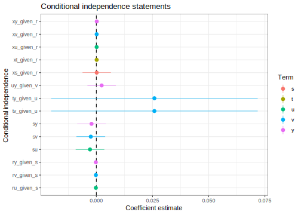
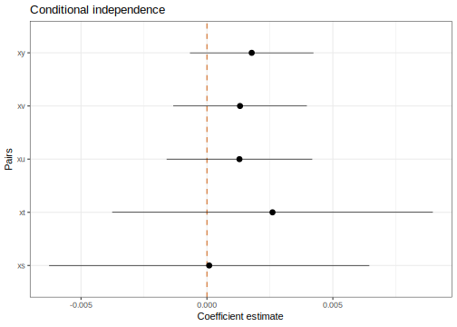
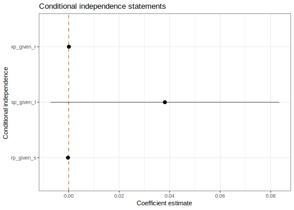

Here are my solutions to Causal Inference in Statistics: a Primer
(CISP), question 2.3.1.

<!--more-->
We'll use the following dataset generated with the structure of figure
2.6 to check our answers. Note that the functions have been chosen so
that all variables have approximately unit variance.

``` {.r}
set.seed(844909)

N <- 100000

df <- tibble(
  x = rnorm(N, 0, 1),
  r = x + rnorm(N, 0, 0.1),
  s = r + rnorm(N, 0, 0.1),
  v = rnorm(N, 0, 1),
  y = v + rnorm(N, 0, 0.1),
  u = v + rnorm(N, 0, 0.1),
  t = sqrt(0.5) * s + sqrt(0.5) * u + rnorm(N, 0, 0.1),
  p = t + rnorm(N, 0, 0.1)
)
```

Part a
------

Conditional on the set $\{R, V\}$, the following pairs of variables are
independent:

-   $X, S$
-   $X, T$
-   $X, U$
-   $X, Y$
-   $S, U$
-   $S, Y$
-   $T, Y$
-   $U, Y$

We can verify that this is the case for our simulated dataset by
regressing the left of each listed pair on the right, including R and V
as covariates. If the pair is independent, then the coefficient of the
right variable should be around 0.

``` {.r}
part_a <- list(
    xs = formula(x ~ 1 + r + v + s),
    xt = formula(x ~ 1 + r + v + t),
    xu = formula(x ~ 1 + r + v + u),
    xy = formula(x ~ 1 + r + v + y),
    su = formula(s ~ 1 + r + v + u),
    sy = formula(s ~ 1 + r + v + y),
    ty = formula(t ~ 1 + r + v + y),
    uy = formula(u ~ 1 + r + v + y)
  ) %>% 
  map(lm, df) %>% 
  map_dfr(broom::tidy, .id = 'model') %>% 
  filter(!(term %in% c('(Intercept)', 'r', 'v'))) %>%
  transmute(
    model,
    term,
    lower = estimate - 2 * std.error, 
    estimate,
    upper = estimate + 2 * std.error
  ) 
```


Part b
------

Given $R$, the following variables are independent:

-   $X, S$
-   $X, T$
-   $X, U$
-   $X, V$
-   $X, Y$

Given $S$, the following variables are independent:

-   $R, T$
-   $R, U$
-   $R, V$
-   $R, Y$

The following variables are unconditionally independent:

-   $S, U$
-   $S, V$
-   $S, Y$

Given $U$, the following variables are independent:

-   $T, V$
-   $T, Y$

Given $V$, the variables $U, Y$ are independent.

The above statements of independence can be verified in the same way as
in part a.

``` {.r}
part_b <- list(
    xs_given_r = formula(x ~ 1 + s + r),
    xt_given_r = formula(x ~ 1 + t + r),
    xu_given_r = formula(x ~ 1 + u + r),
    xv_given_r = formula(x ~ 1 + v + r),
    xy_given_r = formula(x ~ 1 + y + r),
    rt_given_s = formula(r ~ 1 + r + s),
    ru_given_s = formula(r ~ 1 + u + s),
    rv_given_s = formula(r ~ 1 + v + s),
    ry_given_s = formula(r ~ 1 + y + s),
    su = formula(s ~ 1 + u),
    sv = formula(s ~ 1 + v),
    sy = formula(s ~ 1 + y),
    tv_given_u = formula(t ~ 1 + v + u),
    ty_given_u = formula(t ~ 1 + v + u),
    uy_given_v = formula(u ~ 1 + y + v)
  ) %>% 
  map(lm, df) %>% 
  map_dfr(broom::tidy, .id = 'model') %>% 
  filter(term != '(Intercept)') %>% 
  transmute(
    model,
    term,
    lower = estimate - 2 * std.error, 
    estimate,
    upper = estimate + 2 * std.error
  ) 
```



Part c
------

Given $R, P$, the following pairs are independent:

-   $X, S$
-   $X, T$
-   $X, U$
-   $X, V$
-   $X, Y$

``` {.r}
part_c <- list(
    xs = formula(x ~ 1 + r + p + s),
    xt = formula(x ~ 1 + r + p + t),
    xu = formula(x ~ 1 + r + p + u),
    xv = formula(x ~ 1 + r + p + v),
    xy = formula(x ~ 1 + r + p + y)
  ) %>% 
  map(lm, df) %>% 
  map_dfr(broom::tidy, .id = 'model') %>% 
  filter(term != '(Intercept)', term != 'r', term != 'p') %>% 
  transmute(
    model,
    term,
    lower = estimate - 2 * std.error, 
    estimate,
    upper = estimate + 2 * std.error
  ) 
```



Part d
------

All statements from part b still hold. Moreover,

-   given $R$, $(X, P)$ is independent;
-   given $S$, $(R, P)$ is independent; and
-   given $T$, $(S, P)$ is independent.

``` {.r}
part_d <- list(
    xp_given_r = formula(x ~ 1 + p + r),
    rp_given_s = formula(r ~ 1 + p + s),
    sp_given_t = formula(s ~ 1 + p + t)
  ) %>% 
  map(lm, df) %>% 
  map_dfr(broom::tidy, .id = 'model') %>% 
  filter(term == 'p') %>% 
  transmute(
    model,
    term,
    lower = estimate - 2 * std.error, 
    estimate,
    upper = estimate + 2 * std.error
  ) 
```



Part e
------

The variables $X$ and $Y$ are independent given $Z$ if $Z$ is

-   $\emptyset$,
-   $\{ R \}$,
-   $\{ S \}$,
-   $\{ U \}$,
-   $\{ V \}$,
-   $\{ R, T \}$,
-   $\{ S, T \}$,
-   $\{ U, T \}$,
-   $\{ V, T \}$,

or any union of the above.

``` {.r}
part_e <- list(
    empty = formula(y ~ 1 + x),
    r = formula(y ~ 1 + x + r),
    s = formula(y ~ 1 + x + s),
    u = formula(y ~ 1 + x + u),
    v = formula(y ~ 1 + x + v),
    rt = formula(y ~ 1 + x + r + t),
    st = formula(y ~ 1 + x + s + t),
    ut = formula(y ~ 1 + x + u + t),
    vt = formula(y ~ 1 + x + v + t)
  ) %>% 
  map(lm, df) %>% 
  map_dfr(broom::tidy, .id = 'model') %>% 
  filter(term == 'x') %>%
  transmute(
    model,
    term,
    lower = estimate - 2 * std.error, 
    estimate,
    upper = estimate + 2 * std.error
  ) 
```


Part f
------

Conditioning on $T$ blocks all paths between $Y$ and $P$, so $P$ will
have zero coefficient. On the other hand, this conditioning unblocks the
path between $Y$ and $S$, so $S$ will have a non-zero coefficient. The
conditioning on $S$ blocks the path from $X$ or $R$ to $Y$, so the
coefficients of $X$ and $R$ should be zero.

``` {.r}
part_f <- lm(y ~ 1 + x + r + s + t + p, df) %>% 
  broom::tidy() %>% 
  transmute(
    term,
    lower = estimate - 2 * std.error, 
    estimate, 
    upper = estimate + 2 * std.error
  ) 
```


