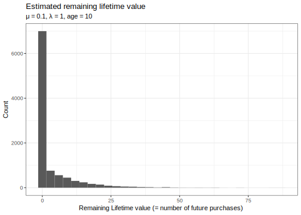
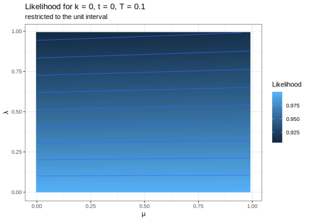
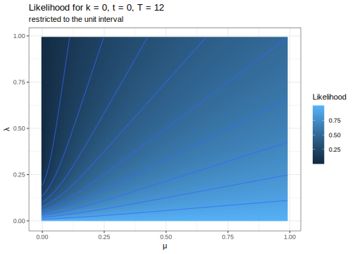
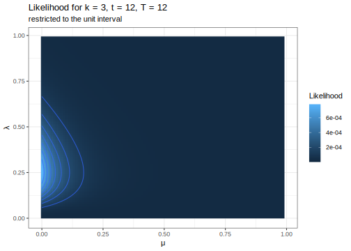
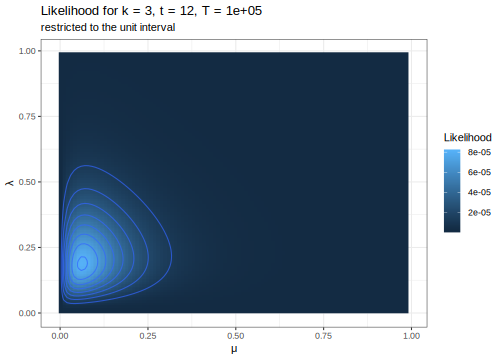

Suppose you have a bunch of customers who make repeat purchases - some
more frequenty, some less. There are a few things you might like to know
about these customers, such as

-   which customers are still active (i.e. not yet churned) and likely
    to continue purchasing from you?; and
-   how many purchases can you expect from each customer?

Modelling this directly is more difficult than it might seem at first. A
customer that regularly makes purchases every day might be considered at
risk of churning if they haven't purchased anything in the past week,
whereas a customer that regularly puchases once per month would not be
considered at risk of churning. That is, churn and frequency of
purchasing are closely related. The difficulty is that we don't observe
the moment of churn of any customer and have to model it
probabilistically.

There are a number of established models for estimating this, the most
well-known perhaps being the [SMC
model](https://pubsonline.informs.org/doi/abs/10.1287/mnsc.33.1.1)
(a.k.a pareto-nbd model). There are already [some
implementations](https://github.com/mplatzer/BTYDplus) using maximum
likelihood or Gibbs sampling. In this post, we'll explain how the model
works, make some prior predictive simulations, and fit a version
implemented in [Stan](https://mc-stan.org/).

<!--more-->
<div>

$\DeclareMathOperator{\dbinomial}{Binomial}  \DeclareMathOperator{\dbern}{Bernoulli}  \DeclareMathOperator{\dpois}{Poisson}  \DeclareMathOperator{\dnorm}{Normal}  \DeclareMathOperator{\dt}{t}  \DeclareMathOperator{\dcauchy}{Cauchy}  \DeclareMathOperator{\dexp}{Exp}  \DeclareMathOperator{\duniform}{Uniform}  \DeclareMathOperator{\dgamma}{Gamma}  \DeclareMathOperator{\dinvgamma}{InvGamma}  \DeclareMathOperator{\invlogit}{InvLogit}  \DeclareMathOperator{\logit}{Logit}  \DeclareMathOperator{\ddirichlet}{Dirichlet}  \DeclareMathOperator{\dbeta}{Beta}$

</div>

Data Generating Process
-----------------------

### Likelihood

Let's describe the model first by simulation. Suppose we have a company
that is 2 years old and a total of 2000 customers, $C$, that have made
at least one purchase from us. We'll assume a linear rate of customer
acquisition, so that the first purchase date is simply a uniform random
variable over the 2 years of the company existance. These assumptions
are just to keep the example concrete, and are not so important for
understanding the model.

``` {.r}
customers <- tibble(id = 1:1000) %>% 
  mutate(
    end = 2 * 365,
    start = runif(n(), 0, end - 1),
    T = end - start
  )
```

The $T$-variable is the total observation time, counted from the date of
first joining to the present day.

First the likelihood. Each customer $c \in C$ is assumed to have a
certain lifetime, $\tau_c$, starting on their join-date. During their
lifetime, they will purchase at a constant rate, $\lambda_c$, so that
they will make $k \sim \dpois(t\lambda_c)$ purchases over a
time-interval $t$. Once their lifetime is over, they will stop
purchasing. We only observe the customer for $T_c$ units of time, and
this observation time can be either larger or smaller than the lifetime,
$\tau_c$. Since we don't observe $\tau_c$ itself, we will assume it
follows an exponential distribution, i.e. $\tau_c \sim \dexp(\mu_c)$.

The following function generates possible observations given $\mu$ and
$\lambda$.

``` {.r}
sample_conditional <- function(mu, lambda, T) {
  
  # lifetime
  tau <- rexp(1, mu)
  
  # start with 0 purchases
  t <- 0
  k <- 0
  
  # simulate time till next purchase
  wait <- rexp(1, lambda)
  
  # keep purchasing till end of life/observation time
  while(t + wait <= pmin(T, tau)) {
    t <- t + wait
    k <- k + 1
    wait <- rexp(1, lambda)
  }
  
  # return tabular data
  tibble(
    mu = mu,
    lambda = lambda,
    T = T,
    tau = tau,
    k = k,
    t = t
  )
}

s <- sample_conditional(0.01, 1, 30) 
```

<table class="table table-responsive" style="margin-left: auto; margin-right: auto;">
<caption>
Example output from sample\_conditional
</caption>
<thead>
<tr>
<th style="text-align:right;">
mu
</th>
<th style="text-align:right;">
lambda
</th>
<th style="text-align:right;">
T
</th>
<th style="text-align:right;">
tau
</th>
<th style="text-align:right;">
k
</th>
<th style="text-align:right;">
t
</th>
</tr>
</thead>
<tbody>
<tr>
<td style="text-align:right;">
0.01
</td>
<td style="text-align:right;">
1
</td>
<td style="text-align:right;">
30
</td>
<td style="text-align:right;">
49.63373
</td>
<td style="text-align:right;">
39
</td>
<td style="text-align:right;">
29.21926
</td>
</tr>
</tbody>
</table>
Given $\mu$ and $\lambda$, the CLV is calculated as follows. The
remaining lifetime is the lifetime minus the age of the customer. So if
the customer is estimated to have a lifetime of 1 year and has been a
customer for 3 months already, then the remaining lifetime will be 9
months.

``` {.r}
lifetime <- function(n, mu, age=0) {
  rexp(n, mu) %>% 
    `-`(age) %>% 
    pmax(0) # remaining lifetime always >= 0
}
```

The number of purchases in a given timeframe (within the customer's
lifetime) is simply a poisson random variable.

``` {.r}
purchases <- function(n, lambda, time) {
  rpois(n, lambda * time)
}
```

To simulate the CLV, we just simulate a possible lifetime remaining,
then simulate the number of puchases in that timeframe. Repeating many
times gives us the distribution of the total number of purchases the
customer is expected to make.

``` {.r}
clv <- function(n, mu, lambda, age=0) {
  lifetime(n, mu, age) %>% 
    purchases(n, lambda, .)
} 
```



The probability of churning is can be estimated by the fraction of
`lifetime` draws that are above 0. For example, for a customer with an
expected lifetime of 10 (i.e. $\mu = 0.1$) and a current age of 10, the
probability of still being active is

``` {.r}
mean(lifetime(100000, 0.1, 10) > 0)
```

    [1] 0.36881

which is roughly $\exp(-0.1 * 10)$, the survival function of the
exponential distribution.

### Priors

Now the priors. Typically, $\mu$ and $\lambda$ are given gamma priors,
which we'll use too. However, the expected mean lifetime
$\mathbb E (\tau) = \frac{1}{\mu}$ is easier to reason about than $\mu$,
so we'll put an inverse gamma distribution on $\frac{1}{\mu}$. The
[reciprocal of an inverse gamma
distribution](https://en.wikipedia.org/wiki/Inverse-gamma_distribution#Related_distributions)
has a gamma distribution, so $\mu$ will still end up with a gamma
distribution.

The mean expected lifetime in our simulated example will be \~2 months,
with a standard deviation of 30. The mean purchase rate will be once a
fortnight, with a standard deviation around 0.05.

``` {.r}
set.seed(2017896)

etau_mean <- 60
etau_variance <- 30^2
etau_beta <- etau_mean^3 / etau_variance + etau_mean
etau_alpha <- etau_mean^2 / etau_variance + 2

lambda_mean <- 1 / 14
lambda_variance <- 0.05^2
lambda_beta <- lambda_mean / lambda_variance
lambda_alpha <- lambda_mean * lambda_beta

df <- customers %>% 
  mutate(
    etau = rinvgamma(n(), etau_alpha, etau_beta),
    mu = 1 / etau,
    lambda = rgamma(n(), lambda_alpha, lambda_beta)
  ) %>% 
  group_by(id) %>% 
  group_map(~sample_conditional(.$mu, .$lambda, .$T)) 
```

<table class="table table-striped table-hover table-responsive" style="margin-left: auto; margin-right: auto;">
<caption>
Sample of customers and their properties
</caption>
<thead>
<tr>
<th style="text-align:right;">
id
</th>
<th style="text-align:right;">
mu
</th>
<th style="text-align:right;">
lambda
</th>
<th style="text-align:right;">
T
</th>
<th style="text-align:right;">
tau
</th>
<th style="text-align:right;">
k
</th>
<th style="text-align:right;">
t
</th>
</tr>
</thead>
<tbody>
<tr>
<td style="text-align:right;">
1
</td>
<td style="text-align:right;">
0.0241091
</td>
<td style="text-align:right;">
0.2108978
</td>
<td style="text-align:right;">
295.3119
</td>
<td style="text-align:right;">
32.2814622
</td>
<td style="text-align:right;">
6
</td>
<td style="text-align:right;">
29.46052
</td>
</tr>
<tr>
<td style="text-align:right;">
2
</td>
<td style="text-align:right;">
0.0122084
</td>
<td style="text-align:right;">
0.0135551
</td>
<td style="text-align:right;">
673.2100
</td>
<td style="text-align:right;">
11.5250690
</td>
<td style="text-align:right;">
0
</td>
<td style="text-align:right;">
0.00000
</td>
</tr>
<tr>
<td style="text-align:right;">
3
</td>
<td style="text-align:right;">
0.0032994
</td>
<td style="text-align:right;">
0.0789800
</td>
<td style="text-align:right;">
357.1805
</td>
<td style="text-align:right;">
4.7921238
</td>
<td style="text-align:right;">
0
</td>
<td style="text-align:right;">
0.00000
</td>
</tr>
<tr>
<td style="text-align:right;">
4
</td>
<td style="text-align:right;">
0.0227431
</td>
<td style="text-align:right;">
0.0980176
</td>
<td style="text-align:right;">
270.0511
</td>
<td style="text-align:right;">
141.4766791
</td>
<td style="text-align:right;">
10
</td>
<td style="text-align:right;">
125.60765
</td>
</tr>
<tr>
<td style="text-align:right;">
5
</td>
<td style="text-align:right;">
0.0270742
</td>
<td style="text-align:right;">
0.0429184
</td>
<td style="text-align:right;">
608.9049
</td>
<td style="text-align:right;">
5.7293256
</td>
<td style="text-align:right;">
0
</td>
<td style="text-align:right;">
0.00000
</td>
</tr>
<tr>
<td style="text-align:right;">
6
</td>
<td style="text-align:right;">
0.0208168
</td>
<td style="text-align:right;">
0.0661296
</td>
<td style="text-align:right;">
666.1305
</td>
<td style="text-align:right;">
0.9481004
</td>
<td style="text-align:right;">
0
</td>
<td style="text-align:right;">
0.00000
</td>
</tr>
</tbody>
</table>
The lifetimes are mostly under 3 months, but also allow some more
extreme values up to around a year.


The purchase rates are mostly around once a fortnight, but there are
also rates as high as 4 purchases per week and ras low as one per
quarter.


Likelihood
----------

The likelihood is somewhat complicated, so we'll derive a more concise
expression for it. Knowing the lifetime simplifies the probabilities, so
we'll marginalise the liklihood over $\tau$.

$$
\begin{align}
  \mathbb P (k, t \mid \mu, \lambda)
  &=
  \int_{\tau = t}^\infty \mathbb P (k, t \mid \mu, \lambda, \tau) \cdot \mathbb P(\tau \mid \mu, \lambda) d\tau
  \\
  &=
  \int_{\tau = t}^T \mathbb P (k, t \mid \mu, \lambda, \tau) \cdot \mathbb P(\tau \mid \mu, \lambda)
  +
  \int_{\tau = T}^\infty \mathbb P (k, t \mid \mu, \lambda, \tau) \cdot \mathbb P(\tau \mid \mu, \lambda)
  \\
  &=
  \int_{\tau = t}^T \dpois(k \mid t\lambda) \cdot \dpois(0 \mid (\tau-t)\lambda) \cdot \dexp(\tau \mid \mu) d\tau
  \\
  &\hphantom{=}
  +
  \int_{\tau = T}^\infty \dpois(k \mid t\lambda) \cdot \dpois(0 \mid (T-t)\lambda) \cdot \dexp(\tau \mid \mu) d\tau
\end{align}
$$

The right-hand side is straight forward. The Poisson probabilities can
be pulled out of the integral since they are independent of $\tau$,
turning the remaining integral into the survival function of the
exponential distribution.

$$
\begin{align}
  \text{RHS}
  &=
  \int_{\tau = T}^\infty \dpois(k \mid t\lambda) \cdot \dpois(0 \mid (T - t)\lambda) \cdot\dexp(\tau \mid \mu) d\tau
  \\
  &=
  \frac{(t\lambda)^k e^{-t\lambda}}{k!} e^{-(T-t)\lambda}\int_T^\infty \dexp(\tau \mid \mu) d\tau
  \\
  &=
  \frac{(t\lambda)^k e^{-T\lambda}}{k!} e^{-T\mu}
  \\
  &=
  \frac{(t\lambda)^k e^{-T(\lambda + \mu)}}{k!} 
\end{align}
$$

The left-hand side is a little more involved.

$$
\begin{align}
  \text{LHS}
  &=
  \int_{\tau = t}^T \dpois(k \mid t\lambda) \cdot \dpois(0 \mid (\tau-t)\lambda) \cdot \dexp(\tau \mid \mu) d\tau
  \\
  &=
  \frac{(t\lambda)^k e^{-t\lambda} }{k!}
  \int_t^T e^{-(\tau - t)\lambda} \mu e^{-\tau\mu} d\tau
  \\
  &=
  \frac{(t\lambda)^k e^{-t\lambda} }{k!} e^{t\lambda} \mu 
  \int_t^T e^{-\tau(\lambda + \mu)} d\tau
  \\
  &=
  \frac{(t\lambda)^k }{k!} \mu 
  \left. 
  \frac{ e^{-\tau(\lambda + \mu)}}{-(\lambda + \mu)} \right|_t^T
  \\
  &=
  \frac{(t\lambda)^k }{k!} \mu 
  \frac{ e^{-t(\lambda + \mu)} - e^{-T(\lambda + \mu)}}{\lambda + \mu} 
\end{align}
$$

Adding both expressions gives our final expression for the likelihood

$$
\begin{align}
  \mathbb P (k, t \mid \mu, \lambda)
  &=
  \frac{(t\lambda)^k e^{-T(\lambda + \mu)}}{k!} 
  +
  \frac{(t\lambda)^k }{k!} \mu 
  \frac{ e^{-t(\lambda + \mu)} - e^{-T(\lambda + \mu)}}{\lambda + \mu} 
  \\
  &\propto
  \lambda^k e^{-T(\lambda + \mu)}
  +
  \lambda^k \mu 
  \frac{ e^{-t(\lambda + \mu)} - e^{-T(\lambda + \mu)}}{\lambda + \mu} 
  \\
  &=
  \frac{\lambda^k}{\lambda + \mu}
  \left( \mu e^{-t(\lambda + \mu)} - \mu e^{-T(\lambda + \mu)} + \mu e^{-T(\lambda + \mu)} + \lambda e^{-T(\lambda + \mu)} \right)
  \\
  &=
  \frac{\lambda^k}{\lambda + \mu}
  \left( \mu e^{-t(\lambda + \mu)} + \lambda e^{-T(\lambda + \mu)} \right)
  ,
\end{align}
$$

where we dropped any factors independent of the parameters,
$\lambda, \mu$. This expression agrees with equation 2 in
[ML07](https://ieeexplore.ieee.org/document/4344404).

Another way to view this likelihood is as a mixture of censored
observations, but where the mixture probability
$p(\mu, \lambda) := \frac{\mu}{\lambda + \mu}$ depends on the
parameters. We can write this alternative interpretation as

$$
\begin{align}
\mathbb P(k, t \mid \mu, \lambda)
&\propto
p \dpois(k \mid t\lambda)S(t \mid \mu) 
\\
&\hphantom{\propto}+ (1 - p) \dpois(k \mid t\lambda)\dpois(0 \mid (T-t)\lambda)S(T \mid \mu)
,
\end{align}
$$

where $S$ is the survival function of the exponential distribution. In
other words, either we censor at $t$ with probability $p$, or we censor
at $T$ with probability $(1 - p)$. Note that

-   either decreasing the expected lifetime (i.e. increasing $\mu$) or
    decreasing the purchase rate increases $p$;
-   if $t \approx T$, then the censored distributions are approximately
    equal. The smaller $\lambda$ is, the closer the approximation has to
    be for this to hold.

To implement this in stan, we'll need the log-likelihood, which is given
by

$$
\log\mathbb P (k, t \mid \mu, \lambda)
=
k \log\lambda - \log(\lambda + \mu) + \log\left(\mu e^{-t(\lambda + \mu)} + \lambda e^{-T(\lambda + \mu)} \right)
.
$$

What does the likelihood "look like"?
-------------------------------------

Let's plot the likelihood to see how it changes as we vary $k$, $t$, and
$T$. We'll use the following functions to do this.

``` {.r}
# calculate the likelihood
likelihood <- function(mu, lambda, k, t, T) {
    log_likelihood <- k * log(lambda) - log(lambda + mu) + log(mu * exp(-t * (lambda + mu)) + lambda * exp(-T * (lambda + mu)))
    return(exp(log_likelihood))
}

# the grid to calculate values for
grid <- crossing(
  mu = seq(0.00001, 1, 0.01),
  lambda = seq(0.00001, 1, 0.01)
) 

# plot it all
plot_likelihood <- function(grid, k, t, T) {
  grid %>% 
    mutate(k = k, t = t, T = T) %>% 
    mutate(likelihood = likelihood(mu, lambda, k, t, T)) %>% 
    ggplot() +
    aes(mu, lambda, fill = likelihood) +
    geom_raster() +
    geom_contour(aes(z = likelihood), alpha = 0.7) +
    labs(
      x = 'μ',
      y = 'λ',
      title = str_glue("Likelihood for k = {k}, t = {t}, T = {T}"),
      subtitle = 'restricted to the unit interval',
      fill = 'Likelihood'
    )
}
```

If $k = t = 0 \approx T$, then we have almost no information to inform
our estimates (we would rely strongly on our priors in this case). We
see that both large and small lifetimes are equally possible, and the
parameter estimates are approximately independent of one another.

``` {.r}
grid %>% 
  plot_likelihood(k = 0, t = 0, T = 0.1) 
```



Adding some observation time changes it up a little. We can increase the
purchase rate without changing the likelihood if we also decrease the
lifetime (= increase $\mu$). This trade-off is almost linear. There are
almost always many customers that haven't made a second purchase yet, so
this case is likely important to deal with well.

``` {.r}
grid %>% 
  plot_likelihood(k = 0, t = 0, T = 12) 
```



If, on the other hand, we do observe some purchases in this period, the
likelihood quickly shrinks around the average purchase rate. Likewise,
the expected lifetime clings around the larger values.

``` {.r}
grid %>% 
  plot_likelihood(k = 3, t = 12, T = 12) 
```



Once a substantial length of time ellapses without any more purchases,
we see the MLE estimate for $\mu$ move away from small values. This
makes sense since we would otherwise have observed more recent
purchases. The estimate for $\mu$ doesn't increase too much though since
we know the lifetime is at least 12.

``` {.r}
grid %>% 
  plot_likelihood(k = 3, t = 12, T = 100000) 
```



Stan implementation
-------------------

Let's take a look at our [Stan implementation](models/pnbd.stan). Note
that Stan uses the log-likelihood, and we can increment it by
incrementing the `target` variable. We have also used the
[`log_sum_exp`](https://mc-stan.org/docs/2_18/functions-reference/composed-functions.html)
for numeric stability, where
$\text{log_sum_exp}(x, y) := \log(e^x + e^y)$.

``` {.r}
pnb <- here('models/pnbd.stan') %>% 
  stan_model() 
```

    S4 class stanmodel 'pnbd' coded as follows:
    data {
      int<lower = 1> n;       // number of customers
      vector<lower = 0>[n] t; // time to most recent purchase
      vector<lower = 0>[n] T; // total observation time
      vector<lower = 0>[n] k; // number of purchases observed

      // user-specified parameters
      real<lower = 0> etau_alpha;
      real<lower = 0> etau_beta;
      real<lower = 0> lambda_alpha;
      real<lower = 0> lambda_beta;
    }

    parameters {
      vector<lower = 0>[n] lambda; // purchase rate
      vector<lower = 0>[n] etau;   // expected mean lifetime
    }

    transformed parameters {
      vector<lower = 0>[n] mu = 1.0 ./ etau;
    }

    model {
      // priors
      etau ~ inv_gamma(etau_alpha, etau_beta);
      lambda ~ gamma(lambda_alpha, lambda_beta);

      // likelihood
      target += k .* log(lambda) - log(lambda + mu);
      for (i in 1:n) {
        target += log_sum_exp(
          log(lambda[i]) - (lambda[i] + mu[i]) .* T[i],
          log(mu[i]) - (lambda[i] + mu[i]) .* t[i]
        );
      }
    } 

Let's fit the model to our simulated data, using the correct priors.

``` {.r}
pnb_fit <- rstan::sampling(
    pnb,
    data = compose_data(
      df,
      etau_alpha = etau_alpha,
      etau_beta = etau_beta,
      lambda_alpha = lambda_alpha,
      lambda_beta = lambda_beta
    ),
    control = list(max_treedepth = 15),
    chains = 4,
    cores = 4,
    warmup = 1000,
    iter = 3000
  ) 
```

Using the default `max_treedepth` of 10 shows problems with the energy
diagnostic, with the `etau` parameters seemingly most problematic.
However, increasing it to 15 resolved these issues.

``` {.r}
pnb_fit %>% 
  check_hmc_diagnostics()
```


    Divergences:

    0 of 8000 iterations ended with a divergence.


    Tree depth:

    0 of 8000 iterations saturated the maximum tree depth of 15.


    Energy:

    E-BFMI indicated no pathological behavior.

There are also no problems with the effective sample sizes, although
`etau` typically has the lowest.

``` {.r}
pnb_neff <- pnb_fit %>% 
  neff_ratio() %>% 
  tibble(
    ratio = .,
    parameter = names(.)
  ) %>% 
  arrange(ratio) %>% 
  head(5) 
```

<table class="table table-responsive" style="margin-left: auto; margin-right: auto;">
<caption>
Parameters with the lowest effective sample size
</caption>
<thead>
<tr>
<th style="text-align:right;">
ratio
</th>
<th style="text-align:left;">
parameter
</th>
</tr>
</thead>
<tbody>
<tr>
<td style="text-align:right;">
0.3877002
</td>
<td style="text-align:left;">
lp\_\_
</td>
</tr>
<tr>
<td style="text-align:right;">
0.4838375
</td>
<td style="text-align:left;">
etau\[716\]
</td>
</tr>
<tr>
<td style="text-align:right;">
0.5157888
</td>
<td style="text-align:left;">
etau\[442\]
</td>
</tr>
<tr>
<td style="text-align:right;">
0.5722499
</td>
<td style="text-align:left;">
etau\[367\]
</td>
</tr>
<tr>
<td style="text-align:right;">
0.5803245
</td>
<td style="text-align:left;">
etau\[443\]
</td>
</tr>
</tbody>
</table>
The rhat statistic also looks good.

``` {.r}
pnb_rhat <- pnb_fit %>% 
  rhat() %>% 
  tibble(
    rhat = .,
    parameter = names(.)
  ) %>% 
  summarise(min(rhat), max(rhat)) 
```

<table class="table table-responsive" style="margin-left: auto; margin-right: auto;">
<caption>
The most extreme rhat values
</caption>
<thead>
<tr>
<th style="text-align:right;">
min(rhat)
</th>
<th style="text-align:right;">
max(rhat)
</th>
</tr>
</thead>
<tbody>
<tr>
<td style="text-align:right;">
0.9995222
</td>
<td style="text-align:right;">
1.001541
</td>
</tr>
</tbody>
</table>
Around 50% of our 50% posterior intervals contain the true value, which
is a good sign.

``` {.r}
calibration <- pnb_fit %>% 
  spread_draws(mu[id], lambda[id]) %>% 
  mean_qi(.width = 0.5) %>% 
  inner_join(df, by = 'id') %>% 
  summarise(
    mu = mean(mu.lower <= mu.y & mu.y <= mu.upper),
    lambda = mean(lambda.lower <= lambda.y & lambda.y <= lambda.upper)
  ) %>% 
  gather(parameter, fraction) 
```

<table class="table table-responsive" style="margin-left: auto; margin-right: auto;">
<caption>
Fraction of 50% posterior intervals containing the true value. These
should be close to 50%.
</caption>
<thead>
<tr>
<th style="text-align:left;">
parameter
</th>
<th style="text-align:right;">
fraction
</th>
</tr>
</thead>
<tbody>
<tr>
<td style="text-align:left;">
mu
</td>
<td style="text-align:right;">
0.495
</td>
</tr>
<tr>
<td style="text-align:left;">
lambda
</td>
<td style="text-align:right;">
0.498
</td>
</tr>
</tbody>
</table>
Discussion
----------

We described the data generating process behind the Pareto-NBD model,
implemented a model in Stan using our derivation of the likelihood, and
fit the model to simulated data. The diagnostics didn't indicate any
convergence problems, and around 50% of the 50% posterior intervals
contained the true parameter values. However, we used our knowledge of
the prior distribution to fit the model. It would be better to use a
hierarchical prior to relax this requirement.

As a next step, it would be interesting to extend the model to

-   estimate spend per purchase;
-   use hierarchical priors on $\mu$ and $\lambda$;
-   allow correlation between $\mu$ and $\lambda$; and
-   allow covariates, such as cohorts.
