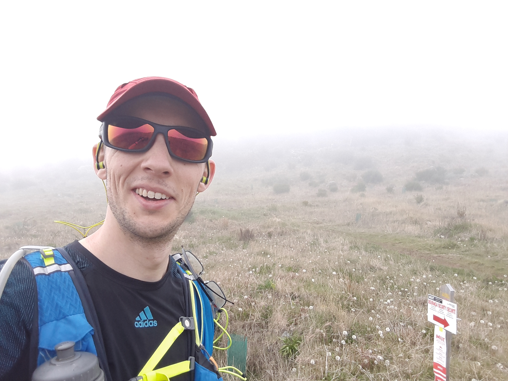

This is my race report for the [MIUT ultra](http://www.madeiraultratrail.com/en/the-event/ultra-course), 2017.

<!--more-->

## Summary

Here is an overview of the course.

Distance 
:   83.9km

Elevation Gain 
:   4400m

Elevation Loss
:   4400m

Time
:   [17:13](https://madeiraultratrail.info/#/event/42/96/results/athlete/10226/24697?embed)

Where
:   Madeira, Portugal

When
:   April 22nd, 2017

## Goals

My main goal was just to finish. I had never run an ultra before and living in Berlin doesn't offer much by way of preparation for something like MIUT. Finishing in a little over 17h was a pleasant surprise.

## Training

I was primarily training for a sub 3h marathon in march with the intention to reverse-taper into the ultra. This would have probably been fine if my motivation hadn't waned.  This was partly due to calf problems but, as it was, I should have trained more.  Much more. I hit a max of 90 km/week in training with fairly minimal speed work.

## Gear

I felt fairly well equipped for the run.

Required:

* Race vest (Nathan Vapor Air)
* Bladder
* Water bottle
* Bivy
* Bandage
* Headlamp (Black Diamond Astro) + spare batteries
* Torch + spare batteries
* Red taillight (Nathan)
* Food (gels, Cliff Bars, trail mix)

Other:

* Running shoes (Saucony Kinvara 7)
* Poles (Black Diamond FLZ Carbon)
* Cap (Salomon)
* Sunglasses
* Gloves
* MP3 player (Scan Disk Clip Sport)
* Waste bag + toilet paper

## Pre-Race

The race start was at 07:00 in São Vicente on the north of the island.  The race organisors offered a shuttle service from Machico (east) to the start, leaving at 05:00, which took away much of the stress of using Madeira's awkward public transport system.  Apart from forgetting my pre-race breakfast of oats, everything ran very smoothly.  Two Cliff bars and a gel had to suffice for breakfast.

## Race

### São Vicente ➡️ Encumeada (12.8km, 1100m+, 390m-, 1:46)

My average speed of over 7kph felt super easy at the time but was too fast in retrospect. I passed many runners on the uphills throughout the entire race, especially here at the start, which perhaps led to overconfidence.  'Easy' in a marathon is different form 'easy' in an ultra.

### Encumeada ➡️ Curral das Freiras (15.3km, 890m+, 1060m-, 3:19)

This is where I made my biggest mistake: starting to jog the downhills.  They felt easy and non-technical but after the massive descent into Curral das Freiras I wasn't able to do any more downhill without pain. I ran out of water (it was HOT) and also thought I had run out gels so I was knackered by the time I got into the checkpoint.  After downing a half litre of Pepsi and devouring a Cliff bar amongst other snacks, I sorted out my pack and found my gels. They were mega useful for the next section.

### Curral das Freiras ➡️ Pico Ruivo (10.8km, 1370m+, 290m-, 2:56)

This section was by far the most stunning and beautiful. Climb, gel, water, repeat, [Moon Hooch](https://www.youtube.com/watch?v=wwBhxBBa7tE)ing all the way to the top. The mountains are epic and it feels almost godlike as you pass through the clouds to the peak. Only occassionally did the dense white fog give way to offer a dizzying glimpse at the sheer cliffs.

The checkpoint was out of power and was running on candlelight as I arrived.  It was so cramped and I was feeling good so I thought I'd 'just' confinue on the next and much larger checkpoint.  "Just 5km", I thought.  Haha!

### Pico Ruivo ➡️ Pico do Areeiro (5.5km, 460m+, 420m-, 1:25)

This section was very technical and the steps were especially steep. Every downhill was agony for my quads and I was grateful for every uphill. I ate lots of trail mix and arrived at the checkpoint utterly exhausted.

Fortunately my dropbag was here and I took the opportunity to rest (~40mins), change my sweat-soaked T-shirt/socks, stock up on calories/water, and take a caffeine pill (200mg). As I lay on the ground waiting for the caffeine to kick in, a guy came sauntering around the corner and, with neither a break in step nor smile, let forth a jet of vomit. A nearby child started to cry as the guy made another projectile offering to the mountain gods. I hope that guy was alright but I can't deny that this lifted my mood. With a caffeine buzz in my body and the [Oh Hellos](https://www.youtube.com/watch?v=rwvCEWWWt7Q) in my ear, I started the next section.

### Pico do Areeiro ➡️ Ribeiro Frio (9.3km, 125m+, 1035m-, 2:23)

The scenery changed drastically here, from single-track mountain paths to open fields, which fitted my now chilled-out mood. The descents still hurt but were manageable. 

As I neared the checkpoint, I realised something wasn't right: my stomach was sore, felt blocked up, and I couldn't eat any more.  Drinking was also unpleasant.  This remained for the rest of the race and, other than two gels, stopped eating for the day. Too much solid food, too early?

### Ribeiro Frio ➡️ Poiso (3.8km, 485m+, 0m-, 1:12)

Ugh, my stomach.

### Poiso ➡️ Portela (8.8km, 30m+, 805m-, 1:43)

Eternal downhill of pain. The last of the sunlight disappeared as I arrived at the checkpoint.

### Portela ➡️ Larano (5.2km, 35m+, 320m-, 0:55)

Three portuguese women were running behind me on the way into Portela and I joined them as they passed.  I'm so grateful to them for getting me moving again.

### Larano ➡️ Ribeira Seca (7.5km, 80m+, 175m-, 1:30)

Darkness and the sound of waves. Time seemed to stand still.

### Ribeira Seca ➡️ Machico (4.3km, 5m+, 220m-, 0:44)

Lots of people ran past me here.  I didn't care any more.  At some point I was walking behing a portuguese guy called [José](https://madeiraultratrail.info/#/event/42/95/results/athlete/10053/24024), who was finishing the full MIUT course.  We walked for an eternity. Thank you, José. The last downhill into the finish was slippery and painful but when we got to the road we jogged it in together.

## Post-Race

Sleep, breakfast x 3, sleep, lunch, ice-cream, jacuzzi.

## Learnings

* Take it really, really easy at the start, especially on the downhills.
* I'm good at uphills.
* Be careful on the downhills, especially when technical.
* I still need to find out why my stomach gave up at ~60km:
    * too much water?
    * too much fibre/solid food early on?
* Do the proper training!
