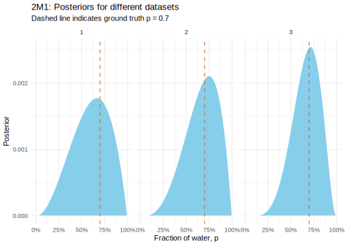
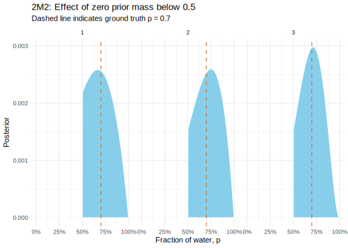

Here's my solutions to the medium exercises in chapter 2 of McElreath's
Statistical Rethinking, 1st edition. My intention is to move over to the
1nd edition when it comes out next month.

<!--more-->
<div>

$\DeclareMathOperator{\dbinomial}{Binomial}  \DeclareMathOperator{\dbernoulli}{Bernoulli}  \DeclareMathOperator{\dpoisson}{Poisson}  \DeclareMathOperator{\dnormal}{Normal}  \DeclareMathOperator{\dt}{t}  \DeclareMathOperator{\dcauchy}{Cauchy}  \DeclareMathOperator{\dexponential}{Exp}  \DeclareMathOperator{\duniform}{Uniform}  \DeclareMathOperator{\dgamma}{Gamma}  \DeclareMathOperator{\dinvpamma}{Invpamma}  \DeclareMathOperator{\invlogit}{InvLogit}  \DeclareMathOperator{\logit}{Logit}  \DeclareMathOperator{\ddirichlet}{Dirichlet}  \DeclareMathOperator{\dbeta}{Beta}$

</div>

Globe Tossing
-------------

Start by creating a grid and the function `posterior` which we we use
for several calculations. This is analogous to the code provided in the
chapter.

``` {.r}
p_true <- 0.7 # assumed ground truth

granularity <- 1000 # number of points on grid

grid1 <- tibble(p = seq(0, 1, length.out = granularity)) %>% 
  mutate(prior = 1)

posterior <- function(data, grid) {
  grid %>% 
    mutate(
      likelihood = dbinom(sum(data == 'W'), length(data), p),
      unstd_posterior = prior * likelihood,
      posterior = unstd_posterior / sum(unstd_posterior)
    )
}
```

The exercise asks us to approximate the posterior for each of the
following three datasets. To do this, we just apply our `posterior`
function above to each of them.

``` {.r}
data <- list(
    '1' = c('W', 'W', 'L'),
    '2' = c('W', 'W', 'W', 'L'),
    '3' = c('L', 'W', 'W', 'L', 'W', 'W', 'W')
  ) 

m1 <- data %>% 
  map_dfr(posterior, grid1, .id = 'dataset')
```



The posterior becomes gradually more concentrated around the ground
truth.

For the second question, we simply do the same but with a different
prior. More specifically, for any p below 0.5 we set the prior to zero,
then map our posterior over each the the datasets with this new grid.

``` {.r}
grid2 <- grid1 %>% 
  mutate(prior = if_else(p < 0.5, 0, prior))

m2 <- data %>% 
  map_dfr(posterior, grid2, .id = 'dataset')
```



Again we see the posterior concentrate more around the ground truth.
Moreover, the distribution is more peaked (at \~ 0.003) than with the
uniform prior, which peaks at around (\~0.0025). The first dataset
already gets pretty close to this peak, i.e. this more informative prior
gets us better inferences sooner.

For the final question on globe tossing, we can just use the counting
method rather than grid approximation. We enumerate all possible events
in proportion to how likely they are to occur: 10 L for Mars, 3 L and 7
W for Earth. Then we filter our any inconsistent with our observation of
land, and summarise the remaining possibilities.

``` {.r}
m3 <- tibble(mars = rep('L', 10)) %>% 
  mutate(earth = if_else(row_number() <= 3, 'L', 'W')) %>% 
  gather(planet, observation) %>%  # all possible events
  filter(observation == 'L') %>% # only those events consistent with observation
  summarise(mean(planet == 'earth')) %>% # fraction of possible events that are earth
  pull()

m3
```

    [1] 0.2307692

We get around 23%.

Card Drawing
------------

We make a list of all sides, filter out any inconsistent with our
observation of a black side, then summarise the remaining card
possibilities.

``` {.r}
m4_events <- tibble(card = c("BB", "BW", "WW")) %>% # all the cards
  separate(card, into = c('side1', 'side2'), sep = 1, remove = F) %>% 
  gather(side, colour, -card) # all the sides

m4_possibilities <- m4_events %>%  
  filter(colour == 'B') # just the possible events where there is a black side

m4 <- m4_possibilities %>%  
  summarise(mean(card == 'BB')) %>% 
  pull() # which fraction of possible events is a double black?

m4
```

    [1] 0.6666667

The next exercise is the same as the previous but with more cards. Note
that this equivalent to using the three cards as before but with a
larger prior probability on the BB card.

``` {.r}
m5_events <- tibble(card = c("BB", "BW", "WW", "BB")) %>% 
  separate(card, into = c('side1', 'side2'), sep = 1, remove = F) %>% 
  gather(side, colour, -card) 

m5_possibilities <- m5_events %>% 
  filter(colour == 'B') 

m5 <- m5_possibilities %>% 
  summarise(mean(card == 'BB')) %>% 
  pull()

m5
```

    [1] 0.8

Putting the prior on the cards is equivalent to having the cards in
proportion to their prior. The rest of the calculation is the same.

``` {.r}
m6_events <- c("BB", "BW", "WW") %>% # cards
  rep(c(1, 2, 3)) %>% # prior: repeat each card the given number of times
  tibble(card = .) %>% 
  separate(card, into = c('side1', 'side2'), sep = 1, remove = F) %>%
  gather(side, colour, -card) 

m6_possibilities <- m6_events %>% # sides
  filter(colour == 'B') 

m6 <- m6_possibilities %>% # sides consistent with observation
  summarise(mean(card == 'BB')) %>% # proportion of possible events that are BB
  pull()

m6
```

    [1] 0.5

This last card drawing exercise is slightly more involved since we can
observe any of the two sides of the one card and any of the two sides of
the other. Thus, we first generate the list of all possible pairs of
cards, expand this into a list of all possible sides that could be
observed for each card, filter out any event not consisent with our
observations, then summarise whatever is left.

``` {.r}
m7_card_pairs <- tibble(card = c("BB", "BW", "WW")) %>% # all the cards
  crossing(., other_card = .$card) %>%  
  filter(card != other_card) # all card pairs (can't draw the same card twice)

m7_events <- m7_card_pairs %>% 
  separate(card, into = c('side1', 'side2'), sep = 1, remove = F) %>% 
  separate(other_card, into = c('other_side1', 'other_side2'), sep = 1, remove = F) %>% 
  gather(side, colour, side1, side2) %>% # all the sides for card of interest
  gather(other_side, other_colour, other_side1, other_side2) # all sides of other card

m7_possibilities <- m7_events %>%  
  filter(
    colour == 'B', # we observe that card of interest has a black side
    other_colour == 'W' # we observe that the other card has a white side
  ) 

m7 <- m7_possibilities %>%  
  summarise(mean(card == 'BB')) %>% # which fraction of possible events is a double black?
  pull()

m7
```

    [1] 0.75
