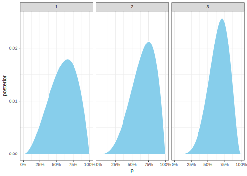
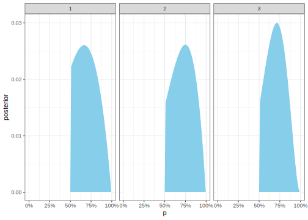

Here's my solution to the medium exercises in chapter 2 of McElreath's
Statistical Rethinking, 2nd edition.

<!--more-->
::: {style="display:none"}
$\DeclareMathOperator{\dbinomial}{Binomial}  \DeclareMathOperator{\dbernoulli}{Bernoulli}  \DeclareMathOperator{\dpoisson}{Poisson}  \DeclareMathOperator{\dnormal}{Normal}  \DeclareMathOperator{\dt}{t}  \DeclareMathOperator{\dcauchy}{Cauchy}  \DeclareMathOperator{\dexponential}{Exp}  \DeclareMathOperator{\duniform}{Uniform}  \DeclareMathOperator{\dpamma}{pamma}  \DeclareMathOperator{\dinvpamma}{Invpamma}  \DeclareMathOperator{\invlogit}{InvLogit}  \DeclareMathOperator{\logit}{Logit}  \DeclareMathOperator{\ddirichlet}{Dirichlet}  \DeclareMathOperator{\dbeta}{Beta}$
:::

``` {.r}
granularity <- 100


grid_1 <- tibble(p = seq(0, 1, length.out = granularity)) %>% 
  mutate(
    prior = 1,
    log_prior = log(prior)
  )

posterior <- function(grid, data) {
  grid %>% 
    mutate(
      log_likelihood = dbinom(sum(data == 'W'), length(data), p, log = T),
      log_unstd_posterior = log_prior + log_likelihood,
      # log_posterior = log_unstd_posterior - prod(log_unstd_posterior),
      # posterior = exp(log_posterior)
      unstd_posterior = exp(log_unstd_posterior),
      posterior = unstd_posterior / sum(unstd_posterior)
    )
}

data = list(
    '1' = c('W', 'W', 'L'),
    '2' = c('W', 'W', 'W', 'L'),
    '3' = c('L', 'W', 'W', 'L', 'W', 'W', 'W')
  ) 

data %>% 
  map_dfr(~posterior(grid_1, .x), .id = 'data') %>% 
  ggplot() + 
  aes(p, posterior) + 
  geom_area(fill = 'skyblue', colour = 'white') +
  scale_x_continuous(labels = percent_format()) +
  facet_wrap(~data)
```



``` {.r}
grid_2 <- tibble(p = seq(0, 1, length.out = granularity)) %>% 
  mutate(
    prior = if_else(p < 0.5, 0, 2),
    log_prior = log(prior)
  )

data %>% 
  map_dfr(~posterior(grid_2, .x), .id = 'data') %>% 
  ggplot() + 
  aes(p, posterior) + 
  geom_area(fill = 'skyblue', colour = 'white') +
  scale_x_continuous(labels = percent_format()) +
  facet_wrap(~data)
```



``` {.r}
m3 <- tibble(mars = rep('L', 10)) %>% 
  mutate(earth = if_else(row_number() <= 3, 'L', 'W')) %>% 
  gather(planet, observation)

m3 %>% 
  filter(observation == 'L') %>% 
  summarise(mean(planet == 'earth'))
```

    # A tibble: 1 x 1
      `mean(planet == "earth")`
                          <dbl>
    1                     0.231
