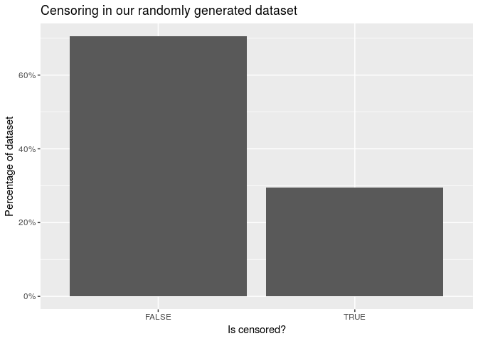
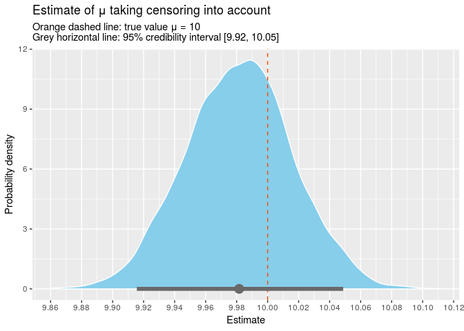

I've recently been interested in understanding survival models, which
model the time to an event of interest (`tte`) but where we are not
always able to wait until that event occurs. This happens, for example,
when modelling the time until a customer
[churns](https://en.wikipedia.org/wiki/Churn_rate): some of your
customers may have cancelled their subscriptions but many hopefully
haven't. Those that haven't are said to be `censored` because we haven't
observed them cancel their subscription yet.

<!--more-->
As a first step in that direction, we'll take a look at modelling
censoring when the `tte` has a Poisson distribution (minor modifications
can be made to extend to other distributions). We'll use
[Stan](http://mc-stan.org/) to implement our model since Bayesian
notation very nicely reflects our statistical understanding. Don't worry
if you aren't familiar with Stan or Bayesian inference - it should be
possible to follow along regardless.

You can download the [R markdown](./censoring.Rmd) and the [stan
model](./censored_poisson.stan) to try it out.

Some theory
-----------

### The Problem

Let's generate some data. We will assume that the time to event (`tte`)
is poisson distributed with mean $\mu = 10$. However, we will also
assume that we don't get to observe the event of interest in every case,
i.e. some cases are censored. What we measure is the time to observation
(`tto`).

``` {.r}
N <- 10000
mu <- 10

df <- tibble(
  id = 1:N,
  tte = rpois(N, mu),
  tto = pmin(rpois(N, 12), tte),
  censored = tto < tte
)

df %>% 
  head() %>% 
  kable() %>% kable_styling()
```

<table class="table" style="margin-left: auto; margin-right: auto;">
<thead>
<tr>
<th style="text-align:right;">
id
</th>
<th style="text-align:right;">
tte
</th>
<th style="text-align:right;">
tto
</th>
<th style="text-align:left;">
censored
</th>
</tr>
</thead>
<tbody>
<tr>
<td style="text-align:right;">
1
</td>
<td style="text-align:right;">
12
</td>
<td style="text-align:right;">
11
</td>
<td style="text-align:left;">
TRUE
</td>
</tr>
<tr>
<td style="text-align:right;">
2
</td>
<td style="text-align:right;">
7
</td>
<td style="text-align:right;">
7
</td>
<td style="text-align:left;">
FALSE
</td>
</tr>
<tr>
<td style="text-align:right;">
3
</td>
<td style="text-align:right;">
4
</td>
<td style="text-align:right;">
4
</td>
<td style="text-align:left;">
FALSE
</td>
</tr>
<tr>
<td style="text-align:right;">
4
</td>
<td style="text-align:right;">
13
</td>
<td style="text-align:right;">
8
</td>
<td style="text-align:left;">
TRUE
</td>
</tr>
<tr>
<td style="text-align:right;">
5
</td>
<td style="text-align:right;">
10
</td>
<td style="text-align:right;">
10
</td>
<td style="text-align:left;">
FALSE
</td>
</tr>
<tr>
<td style="text-align:right;">
6
</td>
<td style="text-align:right;">
15
</td>
<td style="text-align:right;">
8
</td>
<td style="text-align:left;">
TRUE
</td>
</tr>
</tbody>
</table>


Note that we observe `tto` but not `tte`. How might we estimate $\mu$?
One way is to take the mean.

``` {.r}
df %>% 
  select(tte, tto) %>% 
  summarise_all(mean) %>% 
  kable() %>% kable_styling()
```

<table class="table" style="margin-left: auto; margin-right: auto;">
<thead>
<tr>
<th style="text-align:right;">
tte
</th>
<th style="text-align:right;">
tto
</th>
</tr>
</thead>
<tbody>
<tr>
<td style="text-align:right;">
9.9916
</td>
<td style="text-align:right;">
8.9525
</td>
</tr>
</tbody>
</table>
This estimate is fairly good for `tte` but is too low for `tto`. This
was to be expected because we know that `tto` is smaller than `tte` for
censored observations.

It's not possible to just filter out the censored values as this also
gives biased estimates. In fact, it makes our estimate worse in this
case.

``` {.r}
df %>% 
  filter(!censored) %>% 
  select(tte, tto) %>% 
  summarise_all(mean) %>% 
  kable() %>% kable_styling()
```

<table class="table" style="margin-left: auto; margin-right: auto;">
<thead>
<tr>
<th style="text-align:right;">
tte
</th>
<th style="text-align:right;">
tto
</th>
</tr>
</thead>
<tbody>
<tr>
<td style="text-align:right;">
8.916655
</td>
<td style="text-align:right;">
8.916655
</td>
</tr>
</tbody>
</table>
### A more sophisticated way to be wrong

So how can we estimate μ using just `tto`? The first step is to
reinterperet the mean as the estimator that maximises a
[likelihood](https://khakieconomics.github.io/2018/07/14/What-is-a-likelihood-anyway.html)
(the maximum likelihood estimator, or MLE). The likelihood is defined as
the probability of the data given the estimate. Under the true model,
this probability is $f(tte_i \mid \mu) = \text{Poisson}(tte_i \mid \mu)$
for the $i$th case, giving the likelihood of the whole dataset as:

$$
L(\mu) := \prod_{i = 1}^N f(tte_i | \mu)
.
$$

The mean maximises this likelihood, which is why the mean of `tte` is
close to the true value.

To further illustrate this point, note that this is the estimate we get
when regressing `tte` on a constant.

``` {.r}
df %>% 
  glm(
    formula = tte ~ 1,
    family = poisson(link = 'log'),
    data = .
  ) %>% 
  tidy() %>% 
  pull(estimate) %>% 
  exp()
```

    [1] 9.9916

However, we don't observe `tte`; we observe `tto`. Simply replacing
`tte` with `tto` and maximising

$$
L(\mu) := \prod_{i = 1}^N f(tto_i \mid \mu)
$$

gives us the mean of `tto`, which is a bad estimate because this
'likelihood' does not take censoring into account.

### The correct likelihood

So what likelihood can we use? Note that in uncensored cases,
$f(tto_i \mid \mu) = f(tte_i \mid \mu)$, just like above.

In the censored cases, all we know is that `tte` must be larger than
what was observed. This means that we need to sum over the probabilities
of all possibilities:
$S(tto_i \mid \mu) := \sum_{t > tto_i} f(t \mid \mu)$. The full
likelihood is then

$$
L(\mu) 
:= 
\prod_{i = 1}^N \delta_i f(tto_i \mid \mu)
\times
\prod_{i = 1}^N (1 - \delta_i) S(tto_i \mid \mu)
,
$$

where $\delta_i$ is 1 if the event was observed and 0 if censored.
Although we'll stick to the Poisson model in this post, we can use these
ideas to create a likelihood for many different choices of distribution
by using the appropriate probability/survival functions $f$, $S$.

Implementation
--------------

We will fit this model using Stan because it is relatively easy to write
a Bayesian model once we have understood the data generating process.
This will require us to define prior distributions (on $\mu$) just like
with any Bayesian method. Since we are mostly interested in
understanding the likelihood here, we will not give much consideration
to the prior. However, if applying this to a real problem, it would be a
good idea to give this more thought in a [principled Bayesian
workflow](https://betanalpha.github.io/assets/case_studies/principled_bayesian_workflow.html).

### Terminology

Stan makes the following abbreviations:

`pmf`
:   probability mass function,
    $f(tto_i \mid \mu) = \text{Poisson}(tto_i \mid \mu)$

`lpmf`
:   log(`pmf`)

`ccdf`
:   survival function, a.k.a. complementary cumulative distribution
    function,
    $S(tto_i | \mu) := \sum_{t > tto_i} \text{Poisson}(t | \mu)$

`lccdf`
:   log(`ccdf`)

`target`
:   log(posterior probability density) = log(likelihood x prior).

Stan uses the log-scale for its calculations, so we will need the
log-likelihood:

$$
\log L(\mu) 
:= 
\sum_{i = 1}^N \delta_i \log f(tto_i \mid \mu)
+
\sum_{i = 1}^N (1 - \delta_i) \log S(tto_i \mid \mu)
.
$$

### The model

In [our model](./censored_poisson.stan), we add the `lccdf` if the
observation is censored and `lpmf` if not censored. Let's load our model
and take a look.

``` {.r}
model <- stan_model('censored_poisson.stan')
```

``` {.r}
model
```

    S4 class stanmodel 'censored_poisson' coded as follows:
    data {
      // the input data
      int<lower = 1> n;                      // number of observations
      int<lower = 0> tto[n];                 // tto is a list of ints
      int<lower = 0, upper = 1> censored[n]; // list of 0s and 1s
      
      // parameters for the prior
      real<lower = 0> shape;
      real<lower = 0> rate;
    }

    parameters {
      // the parameters used in our model
      real<lower = 0> mu; 
    }

    model {
      // posterior = prior * likelihood
      
      // prior
      mu ~ gamma(shape, rate);
      
      // likelihood
      for (i in 1:n) {
        if (censored[i]) {
          target += poisson_lccdf(tto[i] | mu);  
        } else {
          target += poisson_lpmf(tto[i] | mu);
        }
      }
      
    } 

The language used in the Stan model is slightly different from
R-notation but hopefully intuitive enough to convince yourself that it's
the same model we described above.

Now we can sample from the posterior of our model.

``` {.r}
fit <- model %>% 
  sampling(
    data = compose_data(df, shape = 2, rate = 0.05),
    iter = 2000,
    warmup = 500
  ) 

fit
```

    Inference for Stan model: censored_poisson.
    4 chains, each with iter=2000; warmup=500; thin=1; 
    post-warmup draws per chain=1500, total post-warmup draws=6000.

              mean se_mean   sd      2.5%       25%       50%       75%
    mu        9.98    0.00 0.03      9.92      9.96      9.98     10.01
    lp__ -19613.55    0.01 0.69 -19615.54 -19613.71 -19613.29 -19613.09
             97.5% n_eff Rhat
    mu       10.05  2002    1
    lp__ -19613.04  2924    1

    Samples were drawn using NUTS(diag_e) at Sat Aug  4 15:49:36 2018.
    For each parameter, n_eff is a crude measure of effective sample size,
    and Rhat is the potential scale reduction factor on split chains (at 
    convergence, Rhat=1).

Stan has an amazing array of diagnostics to check the quality of the
fitted model. Since our model is fairly simple and all checks are in
order, I won't describe them here.

The point estimate for `mu` is 9.98 and the true value is contained
within the 95% credible interval \[9.92, 10.05\]. We can also plot all
the samples from our posterior.



Conclusion
----------

We have seen how to change the likelihood to take censored observations
into account. Moreover, the same process works for most distributions,
so you can swap out the Poisson for Weibull/gamma/lognormal or whatever
you want. Using the Bayesian modelling language, Stan, makes it super
easy to test your statistical intuitions by turning them into a workable
model, so I'll definitely be exploring Stan more in the future.
